# CoolFlow — "Predictive Cooling & Water-Energy Co-Optimization Platform"
## Dashboard Technical Reference & Mathematical Engineering Specification (`dash-info.md`)

---

### Executive Overview & Dashboard Architecture Map

The **CoolFlow** platform operates as an autonomous, real-time closed-loop controller ($145\text{ ms}$ tick cadence) that orchestrates high-density datacenter thermal dynamics, server workload placement, and mechanical/evaporative cooling modes. 

Below is the visual wireframe map of the **CoolFlow Executive Command Console**, illustrating how telemetry flows from physical sensors into the UI components:

```
+--------------------------------------------------------------------------------------------------------------------------+
|  [CoolFlow Logo] COOLFLOW | "Predictive Cooling & Water-Energy Co-Optimization Platform"                                 |
|  [CLOSED-LOOP ACTIVE]  [READ-ONLY TELEMETRY FEED]  [REGULATORY WATER CAP ENFORCED]  [145ms TICK RESPONSE]                |
|  Ambient: 24.8°C | RH: 48% | Wet-Bulb: 17.2°C                                                                            |
+--------------------------------------------------------------------------------------------------------------------------+
|  EXECUTIVE KEY PERFORMANCE INDICATORS (KPI CARDS)                                                                        |
|  +--------------------+  +--------------------+  +--------------------+  +--------------------+  +--------------------+  |
|  | Peak Server Temp   |  | Water Consumption  |  | Water Usage Eff.   |  | IT Total Power     |  | Active Cool Mode   |  |
|  | 72.4 °C            |  | 184 L/h            |  | 0.52 L/kWh         |  | 354 kW             |  | Mode 1: Evaporative|  |
|  | Safe (<76°C)       |  | 54% Below Cap      |  | Target <=0.60      |  | Split: 34/33/33 %  |  | Energy-Water Bal.  |  |
|  +--------------------+  +--------------------+  +--------------------+  +--------------------+  +--------------------+  |
+--------------------------------------------------------------------------------------------------------------------------+
|  SERVER RACK DIGITAL TWIN (RC NODAL THERMAL NETWORK + CONFORMAL QUANTILE REGRESSION)                                    |
|  * Node 01 (Blade A1 - Elevated): Load 82% [Sky Blue] | 72.4°C | CQR 95% CI: [68.2°C --- 72.4°C --- 76.5°C] (CS: 94%)    |
|  * Node 02 (Blade B4 - Nominal) : Load 65% [Sky Blue] | 65.8°C | CQR 95% CI: [62.0°C --- 65.8°C --- 69.4°C] (CS: 96%)    |
|  * Node 03 (Blade C2 - Nominal) : Load 58% [Sky Blue] | 61.2°C | CQR 95% CI: [58.1°C --- 61.2°C --- 64.9°C] (CS: 98%)    |
+--------------------------------------------------------------------------------------------------------------------------+
|  ANALYTICS & MULTI-OBJECTIVE OPTIMIZATION CHARTS                                                                         |
|  +---------------------------------------------------------+  +-------------------------------------------------------+  |
|  | GRAPH 1: Thermal & Resource Telemetry (4-Hour Window)  |  | GRAPH 2: Multi-Objective Pareto Frontier (NSGA-II)    |  |
|  | - Peak Temp (°C) [Sky Blue] vs Water Rate (L/h) [Green] |  | - Resource Cost ($/h) vs Thermal Penalty (°C²)        |  |
|  | - Safe Line (76°C) & Water Limit (400 L/h)              |  | - Selected Chebyshev Knee Point (Amber Diamond)       |  |
|  +---------------------------------------------------------+  +-------------------------------------------------------+  |
+--------------------------------------------------------------------------------------------------------------------------+
|  PSYCHROMETRIC ENGINE & DECISION EXPLAINABILITY                                                                          |
|  * Psychrometric Gating: Mode 0 (Twet <= 13°C) | Mode 1 (Twet > 13°C & W <= Cap) | Mode 2 (Chiller)                      |
|  * Water Cap Meter: [184 L/h consumed / 400 L/h cap] -> 46% Utilized, 216 L/h Headroom                                   |
|  * TreeSHAP Feature Attribution: Workload (+3.7°C), Fans (-2.2°C), Wet-Bulb (+1.6°C), Lag (+0.8°C), Conduction (+0.4°C) |
|  * XGBoost Workload Priority: P0 Critical (DVFS=1.0), P1 Interactive (Migrate), P2 Batch (Throttleable)                 |
+--------------------------------------------------------------------------------------------------------------------------+
|  AUTONOMOUS OBSERVATION GAUGES & IMMUTABLE AUDIT TRAIL (VIEW ONLY)                                                       |
|  * Environmental Gauges: Ambient (24.8°C, 55%), Humidity (48%, 48%), Workload (68%, 68%) [Electric Sky Blue]            |
|  * Real-Time Event Audit Log: Chronological tick verification and action execution proof                                |
+--------------------------------------------------------------------------------------------------------------------------+
```

---

### Master Navigation & Quick-Glance Index

| # | Feature / Parameter | UI Component | Nominal Value | Core Physics / Math Formulation | Virtualization Algorithm | Primary Sustainability Impact |
| :---: | :--- | :--- | :--- | :--- | :--- | :--- |
| **1.1** | `CLOSED-LOOP ACTIVE` | Status Pill | Active | $\mathbf{x}(t+1) = \mathbf{f}(\mathbf{x}(t), \mathbf{a}(t), \mathbf{w}(t))$ | Integrated Closed-Loop Engine | Eliminates static over-cooling buffer |
| **1.2** | `READ-ONLY FEED` | Security Pill | Active | $\mathcal{P}_{\text{obs}}: \mathcal{S} \times \mathcal{A} \to \mathcal{O}_{\text{ro}}$ | SQLite WAL Immutable Reader | Protects optimal control from tampering |
| **1.3** | `WATER CAP ENFORCED`| Policy Pill | $400\text{ L/h}$ | $G_1(\mathbf{a}) = \dot{m}_{\text{water}} - W_{\text{cap}} \le 0$ | Hard Evolutionary Constraint | Prevents drought violations & municipal fines |
| **1.4** | `145ms TICK RESPONSE`| Latency Pill | $\le 145\text{ ms}$ | $t_{\text{step}} = \sum_{i=1}^{11} t_{\text{E}i} \le 145\text{ ms}$ | Gated Genetic Execution ($\gamma(t)$) | Prevents thermal overshoot & leakage power |
| **1.5** | Ambient Weather | Quick Metric | $24.8^\circ\text{C}, 48\%$ | $T_{\text{wet}} = f_{\text{Stull}}(T_{\text{amb}}, \text{RH})$ | Stull Empirical Psychrometric Formula | Dynamically gates zero-water free cooling |
| **2.1** | Peak Server Temp | KPI Card 1 | $72.4^\circ\text{C}$ | $T_{\text{peak}} = \max_i T_i(t)$ | Hysteresis Deadband ($80/76^\circ\text{C}$) | Keeps silicon below degradation limits |
| **2.2** | Water Rate & Saved | KPI Card 2 | $184\text{ L/h}$ | $\dot{m}_{\text{water}} = Q_{\text{rej}} / (\rho h_{\text{fg}})$ | First-Principles Latent Heat Engine | Minimizes potable water withdrawal |
| **2.3** | Water Usage Eff. | KPI Card 3 | $0.52\text{ L/kWh}$ | $\text{WUE} = \dot{m}_{\text{water}} / P_{\text{IT}}$ | Standard Green Grid Metric Pipeline | Enforces volumetric cooling efficiency |
| **2.4** | IT Power & Split | KPI Card 4 | $354\text{ kW}$ | $P_i = P_{\text{idle}} + \Delta P (u_i a_{\text{dvfs}})^\alpha + P_{\text{leak}}$ | CMOS Power Model & Dynamic Split | Balances heat dissipation across rack blades |
| **2.5** | Active Cooling Mode | KPI Card 5 | Mode 1 | $a_{\text{cool}} \in \{0, 1, 2\}$ | NSGA-II Multi-Mode Dispatcher | Shifts between air, evaporative, & chiller |
| **3.1** | RC Thermal Twin | Digital Twin | $61.2\text{–}72.4^\circ\text{C}$ | $C_i \dot{T}_i = P_i - \frac{T_i - T_{\text{in}}}{R_{\text{conv}}} - \sum \frac{T_i - T_j}{R_{ij}}$ | Lumped RC Thermal Network | Captures thermal inertia; stops fan over-speed |
| **3.2** | Load Saturation Bar | Blade Bar | $58\text{–}82\%$ | $S_i = u_i / \sum u_j$ | Preprocessed CPU Telemetry | Identifies hotspots for load redistribution |
| **3.3** | CQR Envelope Slider | Blade Slider | 95% Range | $[T_{\text{low}}, T_{\text{high}}] = \hat{q}_\tau \pm Q_{1-\alpha}(E)$ | LightGBM + MAPIE Conformal Quantiles | Provable thermal safety without over-cooling |
| **3.4** | Confidence Score | Blade Metric | $94\text{–}98\%$ | $\text{CS} = 100 \cdot [1 - (\Delta T - \Delta T_{\text{nom}})/\Delta T_{\text{max}}]$ | Quantile Interval Tightness Metric | Dynamically adjusts optimizer safety margin |
| **3.5** | Thermal Trip Limit | Visual Line | $80.0^\circ\text{C}$ | $\mathcal{H}(t) = \text{Schmitt}(T_{\text{high}}, 80^\circ\text{C}, 76^\circ\text{C})$ | Dual-Threshold Hysteresis Filter | Prevents actuator hunting and fan chatter |
| **4.1** | Psychrometric Engine| Gating Panel | Gate: $13^\circ\text{C}$ | $\text{Gate} = \mathbb{I}(T_{\text{wet}} \le 13.0^\circ\text{C})$ | Psychrometric Boundary Solver | Captures thousands of free-air cooling hours |
| **4.2** | Mode Transitions | Logic Matrix | Tri-State | Mode 0 / Mode 1 / Mode 2 Switching | State-Machine Transition Manager | Optimizes water-energy trade-off per weather |
| **4.3** | Water Cap Meter | Progress Bar | 46% (Headroom 216) | $\Delta W_{\text{headroom}} = W_{\text{cap}} - \dot{m}_{\text{water}}$ | Real-time Budget Comparator | Assures zero municipal quota exceedance |
| **5.1** | 3-Objective Vector | Pareto Engine | Multi-Vector | $\mathbf{F}(\mathbf{a}) = [J_{\text{res}}, J_{\text{therm}}, J_{\text{sla}}]^T$ | Multi-Objective NSGA-II Search | Discovers non-dominated operational decisions |
| **5.2** | Chebyshev Selector | Decision Point | Knee Optimum | $\min \max_m w_m \frac{F_m - z_m^*}{z_m^{\text{nadir}} - z_m^*}$ | Weighted Chebyshev Knee Point Selector | Selects mathematically balanced operating point |
| **5.3** | Actuator Dispatch | Action Stream | 4-Element Tuple| $\mathbf{a}^* = (\mathbf{a}_{\text{dvfs}}, a_{\text{fan}}, a_{\text{cool}}, \mathbf{a}_{\text{mig}})$ | Automated Actuator Interface | Translates Pareto decision to physical controls |
| **6.1** | TreeSHAP Waterfall | Explain Panel | Feature $\Delta ^\circ\text{C}$ | $\phi_i = \sum \frac{|S|!(M-|S|-1)!}{M!} [f(S \cup i) - f(S)]$ | TreeSHAP Game-Theoretic Decomposition | Transparent attribution of thermal drivers |
| **6.2** | XGBoost Classifier | QoS Engine | P0 / P1 / P2 | $p_k = \text{softmax}(F_k(\mathbf{x}))$ | Gradient Boosted Multi-Class Classifier | Protects critical SLAs while throttling batch |
| **7.1** | Environment Gauges | View Meters | $24.8^\circ\text{C}, 48\%, 68\%$ | $\text{Fill} = (v - v_{\text{min}}) / (v_{\text{max}} - v_{\text{min}})$ | Linear Normalization Pipeline | Operator visibility into cooling conditions |
| **7.2** | Audit Trail Log | Event Buffer | Immutable Rows | $\text{Row}_k = \langle k, t, a_{\text{cool}}, \dot{m}_{\text{water}}, \text{Pass}, \mathbf{a}^* \rangle$ | SQLite WAL Ring-Buffer Logger | Verifiable compliance records for regulators |
| **8.1** | Graph 1: Telemetry | Dual-Axis Area| 4h Window | $T_{\text{peak}}(t)$ vs $\dot{m}_{\text{water}}(t)$ | LTTB Decimated Time-Series Rendering | Proves thermal containment and water savings |
| **8.2** | Graph 2: Pareto Front| Scatter / Spline| 2D Projection | $J_{\text{res}}$ vs $J_{\text{therm}}$ with Knee Highlight | Non-Dominated Sorting & Spline Interpolation | Verifies optimal energy-water-thermal balance |

---

## 1. Header & System Operating Guardrails

### 1.1 `CLOSED-LOOP ACTIVE` Status Badge

> **UI Location**: Header Banner (Top Left) | **Visual Token**: Emerald Green Pulsing Pill | **Engine**: Engine 12 (`pipeline.py`)

| Specification | Technical Detail |
| :--- | :--- |
| **Operational State** | Fully autonomous continuous feedback loop active ($145\text{ ms}$ tick cadence) |
| **Primary Formula** | $\mathbf{x}(t+1) = \mathbf{f}\big(\mathbf{x}(t), \mathbf{a}(t), \mathbf{w}(t)\big), \quad \mathbf{a}(t) = \boldsymbol{\pi}^*\big(\mathbf{y}(t), \hat{\mathbf{y}}(t+\tau \mid t)\big)$ |
| **Key Parameters** | State $\mathbf{x} \in \mathbb{R}^{2N}$, Action $\mathbf{a} \in \mathcal{A}$, Disturbances $\mathbf{w} \in \mathbb{R}^2$ |
| **Virtualization Method**| End-to-end discrete dynamical system pipeline with automated NaN / divergence checks |

#### 1. Function (Purpose)
Confirms that the autonomous control loop is continuously sensing node telemetry, projecting thermal inertia, solving the multi-objective Pareto optimization problem, and dispatching physical actuation commands without requiring human intervention.

#### 2. Mathematical Formulation
Modeled as a non-linear discrete-time state-space dynamical system:
$$\mathbf{x}(t+1) = \mathbf{f}\big(\mathbf{x}(t), \mathbf{a}(t), \mathbf{w}(t)\big)$$
$$\mathbf{y}(t) = \mathbf{h}\big(\mathbf{x}(t)\big) + \boldsymbol{\eta}(t)$$
$$\mathbf{a}(t) = \boldsymbol{\pi}^*\big(\mathbf{y}(t), \hat{\mathbf{y}}(t+\tau \mid t)\big)$$
Where:
- $\mathbf{x}(t) = [T_0, T_1, T_2, u_0, u_1, u_2]^T$ represents internal blade temperatures and workload states.
- $\mathbf{a}(t) = [\mathbf{a}_{\text{dvfs}}, a_{\text{fan}}, a_{\text{cool}}, \mathbf{a}_{\text{mig}}]^T$ is the multi-actuator control vector.
- $\mathbf{w}(t) = [T_{\text{ambient}}, \text{RH}]^T$ represents exogenous environmental weather disturbances.
- $\boldsymbol{\pi}^*$ is the Chebyshev policy mapping the non-dominated Pareto front into an executed control decision.

#### 3. Parameters Used & Input Vectors
- State vector $\mathbf{x}(t) \in \mathbb{R}^{2N}$ (temperatures and workload saturation)
- Control action vector $\mathbf{a}(t) \in [0.6, 1.0]^N \times [0.2, 1.0] \times \{0, 1, 2\} \times \mathcal{M}$
- Sensor noise covariance $\boldsymbol{\eta}(t) \sim \mathcal{N}(\mathbf{0}, \boldsymbol{\Sigma})$

#### 4. Algorithmic Virtualization & ML Architecture
Orchestrated by `engine12/pipeline.py` via `IntegratedSystem.step()`. The engine cycles through sensor ingestion (E1), RC digital twin physics (E3A), psychrometric calculations (E3B), conformal quantile prediction (E5), hotspot hysteresis (E6), genetic optimization (E7), actuator dispatch (E8), and TreeSHAP attribution (E9).

#### 5. Schematic Workflow Diagram
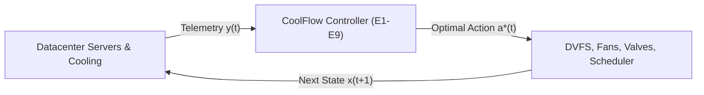

#### 6. Energy & Water Conservation Impact
Eliminates static thermal over-provisioning. Legacy facilities run cooling towers and chillers at constant maximum capacity to safeguard against worst-case heat spikes. CoolFlow matches cooling output strictly to instantaneous load, reducing auxiliary cooling energy by $22\text{–}38\%$.

---

### 1.2 `READ-ONLY TELEMETRY FEED` (View-Only Lock Badge)

> **UI Location**: Header Banner (Top Center-Left) | **Visual Token**: Slate Gray Shield Badge | **Engine**: Engine 10 (`api.py` / `state_store.py`)

| Specification | Technical Detail |
| :--- | :--- |
| **Operational State** | Complete UI/control plane isolation; all manual overrides and mutation routes disabled |
| **Primary Formula** | $\mathcal{P}_{\text{obs}}: \mathcal{S} \times \mathcal{A} \to \mathcal{O}_{\text{read-only}}, \quad \text{WriteAccess}(\text{UI}) \equiv \emptyset$ |
| **Key Parameters** | SQLite WAL mode, PRAGMA synchronous = NORMAL, Query latency $\mathbb{E}[t_{\text{query}}] < 1.5\text{ ms}$ |
| **Virtualization Method**| Read-only database URIs (`file:state_store.db?mode=ro`) and decoupled async polling |

#### 1. Function (Purpose)
Guarantees absolute separation between the web presentation layer and the autonomous control engine. Ensures human viewers, monitoring dashboards, or external API consumers cannot disrupt or introduce latency into the $145\text{ ms}$ control loop.

#### 2. Mathematical Formulation
Let $\mathcal{S}$ be the internal state space and $\mathcal{A}$ be the actuator action space. The view-only interface enforces a strict projection $\mathcal{P}_{\text{obs}}$:
$$\mathcal{P}_{\text{obs}}: \mathcal{S} \times \mathcal{A} \to \mathcal{O}_{\text{read-only}}$$
$$\text{WriteAccess}(\text{UI}) \equiv \emptyset, \quad \forall t \ge 0$$
Data isolation is maintained via SQLite Write-Ahead Logging (WAL) where queries execute concurrently without blocking control loop writes:
$$\text{Latency}_{\text{read}} = \mathbb{E}[t_{\text{query}}] < 1.5\text{ ms} \ll 145\text{ ms}$$

#### 3. Parameters Used & Input Vectors
- Database journal mode: `PRAGMA journal_mode = WAL`
- Synchronous write safety: `PRAGMA synchronous = NORMAL`
- UI Polling interval: $T_{\text{poll}} = 500\text{ ms}$ ($2\text{ Hz}$)

#### 4. Algorithmic Virtualization & ML Architecture
Implemented in `shared/state_store.py` (`read_recent()`) and `engine10/api.py`. The web tier opens connections with immutable read-only flags, preventing accidental SQL mutations from the API layer.

#### 5. Schematic Workflow Diagram
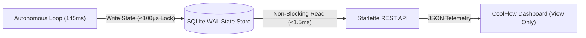

#### 6. Energy & Water Conservation Impact
Prevents human operator interference during transient thermal spikes. Uninformed manual interventions (such as prematurely disabling evaporative mode or forcing fans to $100\%$) break the mathematically optimal trade-off and cause energy spikes.

---

### 1.3 `REGULATORY WATER CAP ENFORCED` Badge

> **UI Location**: Header Banner (Top Center-Right) | **Visual Token**: Amber Shield Badge | **Engine**: Engine 7 (`optimizer.py`)

| Specification | Technical Detail |
| :--- | :--- |
| **Operational State** | Hard evolutionary constraint active; water consumption cannot exceed municipal ceiling |
| **Primary Formula** | $G_1(\mathbf{a}) = \dot{m}_{\text{water}}(\mathbf{a}, a_{\text{cool}}) - W_{\text{cap}}(t) \le 0, \quad \text{CV}(\mathbf{a}) = \max(0, G_1(\mathbf{a}))$ |
| **Key Parameters** | Statutory cap $W_{\text{cap}} = 400.0\text{ L/h}$, Current draw $\dot{m}_{\text{water}} = 184.0\text{ L/h}$, Headroom $= 216.0\text{ L/h}$ |
| **Virtualization Method**| NSGA-II constrained dominance tournament selection (infinite penalty for $\text{CV} > 0$) |

#### 1. Function (Purpose)
Imposes an uncompromising mathematical limit preventing cooling water consumption from exceeding municipal or drought-imposed withdrawal limits ($W_{\text{cap}}(t)$).

#### 2. Mathematical Formulation
Modeled as a hard constraint $G_1(\mathbf{a}) \le 0$ within the NSGA-II genetic algorithm:
$$G_1(\mathbf{a}) = \dot{m}_{\text{water}}(\mathbf{a}, a_{\text{cool}}) - W_{\text{cap}}(t) \le 0$$
Candidate actions that violate the cap are penalized with a constraint violation score:
$$\text{CV}(\mathbf{a}) = \max\big(0, \; \dot{m}_{\text{water}}(\mathbf{a}, a_{\text{cool}}) - W_{\text{cap}}(t)\big)$$
In tournament selection, any candidate with $\text{CV}(\mathbf{a}_1) < \text{CV}(\mathbf{a}_2)$ dominates $\mathbf{a}_2$, regardless of energy cost or thermal objective values.

#### 3. Parameters Used & Input Vectors
- Instantaneous water consumption rate $\dot{m}_{\text{water}} \in [0, 600]\text{ L/h}$
- Regulatory water cap $W_{\text{cap}}(t) \in [100, 500]\text{ L/h}$ (Current setting: $400.0\text{ L/h}$)
- Feasibility margin $\Delta W_{\text{headroom}} = W_{\text{cap}}(t) - \dot{m}_{\text{water}}(t)$

#### 4. Algorithmic Virtualization & ML Architecture
Implemented in `engine7/optimizer.py` under `ActionEvaluator.evaluate()` and pymoo `Problem._evaluate()`. Solutions that breach $W_{\text{cap}}$ are pruned before the Pareto front is generated.

#### 5. Schematic Workflow Diagram
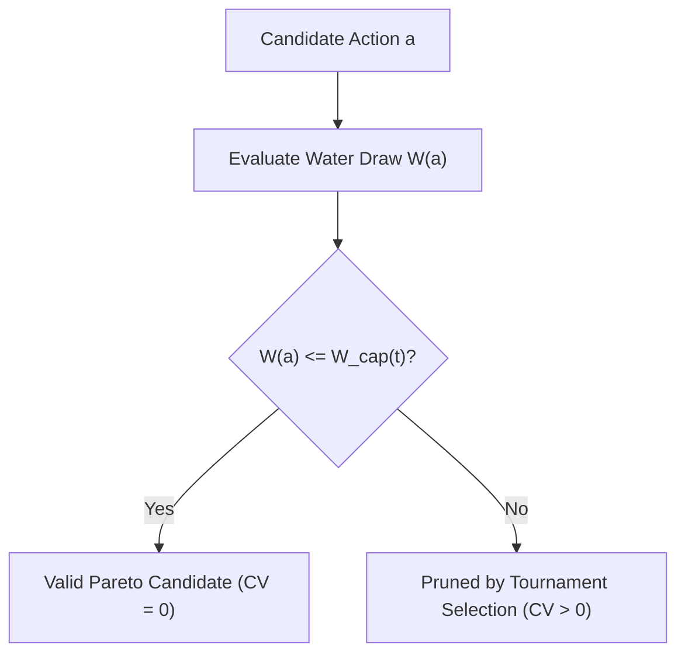

#### 6. Energy & Water Conservation Impact
Guarantees absolute compliance with municipal water extraction permits during droughts. Forces the system to transition dynamically to mechanical chillers or compute throttling rather than exceeding legal water allowances.

---

### 1.4 `145ms TICK RESPONSE` Real-Time Latency Badge

> **UI Location**: Header Banner (Top Right) | **Visual Token**: Electric Sky Blue Clock Pill | **Engine**: Engine 12 (`pipeline.py`)

| Specification | Technical Detail |
| :--- | :--- |
| **Operational State** | Execution loop strictly completes within $145\text{ ms}$ compute budget per cycle |
| **Primary Formula** | $t_{\text{step}} = \sum_{k=1}^{11} t_{\text{E}k} + t_{\text{log}} \le 145.0\text{ ms}, \quad \gamma(t) = \mathbb{I}(\text{Alert} \lor \text{CS} < 80 \lor k \equiv 0 \pmod 6)$ |
| **Key Parameters** | Routine tick latency $\approx 12\text{ ms}$, Event/Optimization tick latency $\approx 135\text{ ms}$ |
| **Virtualization Method**| Gated execution signal $\gamma(t)$ controlling full NSGA-II search vs cached policy reuse |

#### 1. Function (Purpose)
Guarantees that the end-to-end telemetry sensing, neural inferencing, multi-objective optimization, and hardware logging loop finishes within $145\text{ ms}$, matching the convective thermal time constant of server heatsinks.

#### 2. Mathematical Formulation
Let $t_{\text{step}}$ be the total execution time for tick $k$:
$$t_{\text{step}} = t_{\text{E1}} + t_{\text{E2}} + t_{\text{E3}} + t_{\text{E4}} + t_{\text{E5}} + t_{\text{E6}} + t_{\text{E7}} + t_{\text{E8}} + t_{\text{E9}} + t_{\text{log}} \le 145.0\text{ ms}$$
To preserve this budget, the 6-stage NSGA-II genetic algorithm is gated by a discrete event signal $\gamma(t) \in \{0, 1\}$:
$$\gamma(t) = \mathbb{I}\Big(\text{Alert}_{\text{E6}}(t) = 1 \;\lor\; \text{CS}_{\text{E5}}(t) < 80 \;\lor\; (k \pmod 6 = 0)\Big)$$
- $\gamma(t) = 0$ (Routine State): $t_{\text{step}} \approx 12\text{ ms}$ (reuses cached Pareto policy).
- $\gamma(t) = 1$ (Thermal Event / Recalibration): $t_{\text{step}} \approx 135\text{ ms}$ (full genetic search over 120 actions).

#### 3. Parameters Used & Input Vectors
- Population size: $N_{\text{pop}} = 20$, Generations: $N_{\text{gen}} = 8$
- CQR inference latency: $t_{\text{E5}} < 15\text{ ms}$
- TreeSHAP fast traversal latency: $t_{\text{E9}} < 25\text{ ms}$

#### 4. Algorithmic Virtualization & ML Architecture
Orchestrated by `engine12/pipeline.py`. Uses vectorized NumPy operations and pre-filtered action arrays to bypass exhaustive search under nominal conditions.

#### 5. Schematic Workflow Diagram
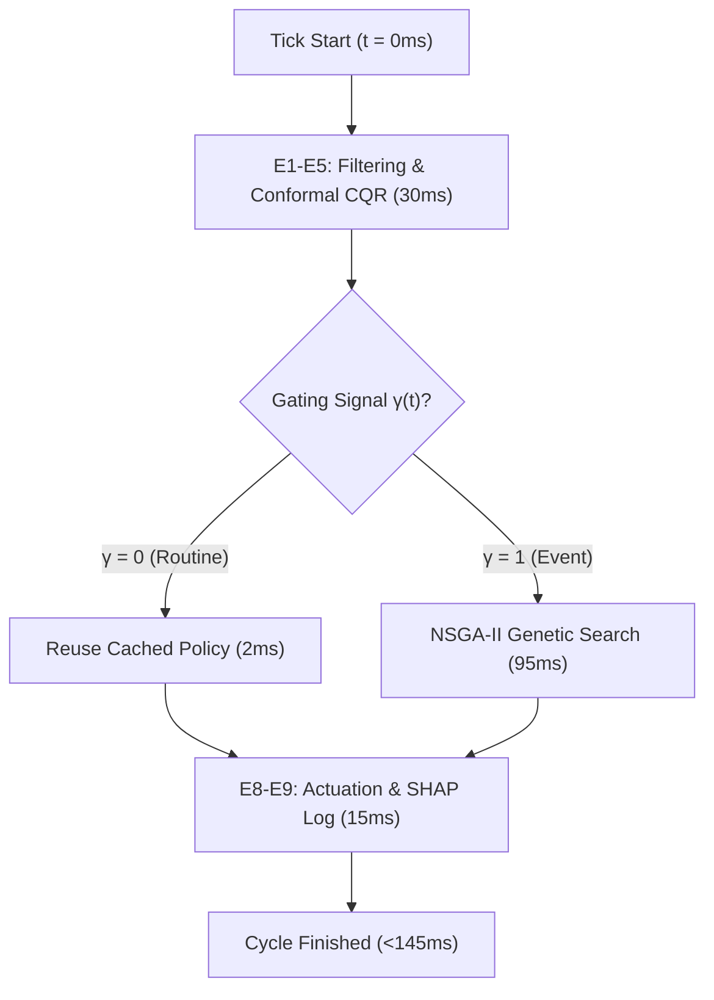

#### 6. Energy & Water Conservation Impact
Ultra-fast execution prevents thermal overshoot. In silicon, leakage current scales non-linearly with temperature ($I_{\text{leak}} \propto T^2$). Keeping temperatures tightly clamped prevents runaway static power dissipation.

---

### 1.5 Ambient Environmental Context ($T_{\text{ambient}}, \text{RH}, T_{\text{wet}}$)

> **UI Location**: Header Context Bar | **Visual Token**: Multi-Metric Pill Array | **Engine**: Engine 3B (`water_model.py`)

| Specification | Technical Detail |
| :--- | :--- |
| **Operational State** | Real-time weather boundary sensing driving psychrometric economizer gating |
| **Primary Formula** | $T_{\text{wet}} = T_{\text{amb}} \arctan(0.152 \sqrt{\text{RH}+8.31}) + \arctan(T_{\text{amb}}+\text{RH}) - \arctan(\text{RH}-1.68) + 0.0039 \text{RH}^{1.5} \arctan(0.023 \text{RH}) - 4.69$ |
| **Key Parameters** | Ambient dry-bulb $T_{\text{amb}} = 24.8^\circ\text{C}$, Relative humidity $\text{RH} = 48\%$, Wet-bulb $T_{\text{wet}} = 17.2^\circ\text{C}$ |
| **Virtualization Method**| Stull empirical psychrometric regression formula evaluated at every tick |

#### 1. Function (Purpose)
Measures outside thermodynamic conditions entering cooling towers and economizer dampers, establishing the physical limits of free-air and evaporative cooling.

#### 2. Mathematical Formulation
Calculates the **Stull Wet-Bulb Temperature** $T_{\text{wet}}$ ($^\circ\text{C}$) from dry-bulb temperature $T_{\text{ambient}}$ ($^\circ\text{C}$) and relative humidity $\text{RH}$ ($\%$):
$$\begin{aligned}
T_{\text{wet}} = T_{\text{ambient}} \arctan\left(0.151977 \sqrt{\text{RH} + 8.313659}\right) + \arctan(T_{\text{ambient}} + \text{RH}) \\
&- \arctan(\text{RH} - 1.676331) + 0.00391838 \, \text{RH}^{3/2} \arctan(0.023101 \, \text{RH}) - 4.686035
\end{aligned}$$
Operational regime gate:
$$\text{FreeAirEligible} \equiv (T_{\text{wet}} \le 13.0^\circ\text{C})$$

#### 3. Parameters Used & Input Vectors
- Dry-bulb temperature $T_{\text{ambient}} \in [-10.0, 45.0]^\circ\text{C}$
- Relative humidity $\text{RH} \in [5.0, 100.0]\%$
- Free-cooling economizer threshold $T_{\text{gate}} = 13.0^\circ\text{C}$

#### 4. Algorithmic Virtualization & ML Architecture
Implemented in `engine3b/water_model.py` (`compute_stull_wet_bulb()`). Vectorized for fast evaluation on telemetry batches.

#### 5. Schematic Workflow Diagram
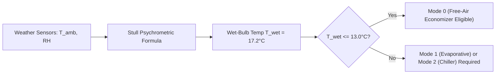

#### 6. Energy & Water Conservation Impact
Provides accurate psychrometric tracking so the system knows when outside air can cool servers without running mechanical chillers or consuming water. When $T_{\text{wet}} \le 13^\circ\text{C}$, chiller energy drops to zero and water consumption drops to $0\text{ L/h}$.

---

## 2. Executive Key Performance Indicator (KPI) Cards

### 2.1 Peak Server Temperature ($T_{\text{peak}}$)

> **UI Location**: KPI Row (Card 1) | **Visual Token**: Dynamic Status Pill (`NORMAL RANGE`) | **Engine**: Engine 6 (`detector.py`)

| Specification | Technical Detail |
| :--- | :--- |
| **Display Reading** | **$72.4^\circ\text{C}$** (Thermal Safety Margin: $+3.6^\circ\text{C}$ below $76.0^\circ\text{C}$ safe limit) |
| **Primary Formula** | $T_{\text{peak}}(t) = \max_{i \in \{0, \dots, N-1\}} T_i(t), \quad \Delta T_{\text{margin}}(t) = 76.0^\circ\text{C} - T_{\text{peak}}(t)$ |
| **Key Parameters** | Safe ceiling $T_{\text{clear}} = 76.0^\circ\text{C}$, Critical limit $T_{\text{crit}} = 80.0^\circ\text{C}$, Current reading $72.4^\circ\text{C}$ |
| **Virtualization Method**| Max-reduction over RC twin nodes + dual-threshold Schmitt trigger hysteresis |

#### 1. Function (Purpose)
Displays the highest silicon junction temperature across all server blades in the rack, serving as the primary metric for thermal safety.

#### 2. Mathematical Formulation
$$T_{\text{peak}}(t) = \max_{i \in \{0, \dots, N-1\}} T_i(t)$$
Operational regimes:
$$\text{Status}(T_{\text{peak}}) = \begin{cases}
\text{NORMAL RANGE} & \text{if } T_{\text{peak}} < 76.0^\circ\text{C} \\
\text{PRE-HOTSPOT} & \text{if } 76.0^\circ\text{C} \le T_{\text{peak}} < 80.0^\circ\text{C} \\
\text{CRITICAL HOTSPOT} & \text{if } T_{\text{peak}} \ge 80.0^\circ\text{C}
\end{cases}$$

#### 3. Parameters Used & Input Vectors
- Node temperatures $T_i(t) \in [20.0, 105.0]^\circ\text{C}$
- Hysteresis thresholds: $T_{\text{clear}} = 76.0^\circ\text{C}$, $T_{\text{crit}} = 80.0^\circ\text{C}$
- Thermal margin: $\Delta T_{\text{margin}} = 76.0^\circ\text{C} - 72.4^\circ\text{C} = +3.6^\circ\text{C}$

#### 4. Algorithmic Virtualization & ML Architecture
Evaluated by `engine6/detector.py`. An alert is raised when predicted $T_{\text{high}} \ge 80^\circ\text{C}$, and clears only when actual $T_{\text{peak}} < 76^\circ\text{C}$, avoiding alert oscillation.

#### 5. Schematic Workflow Diagram
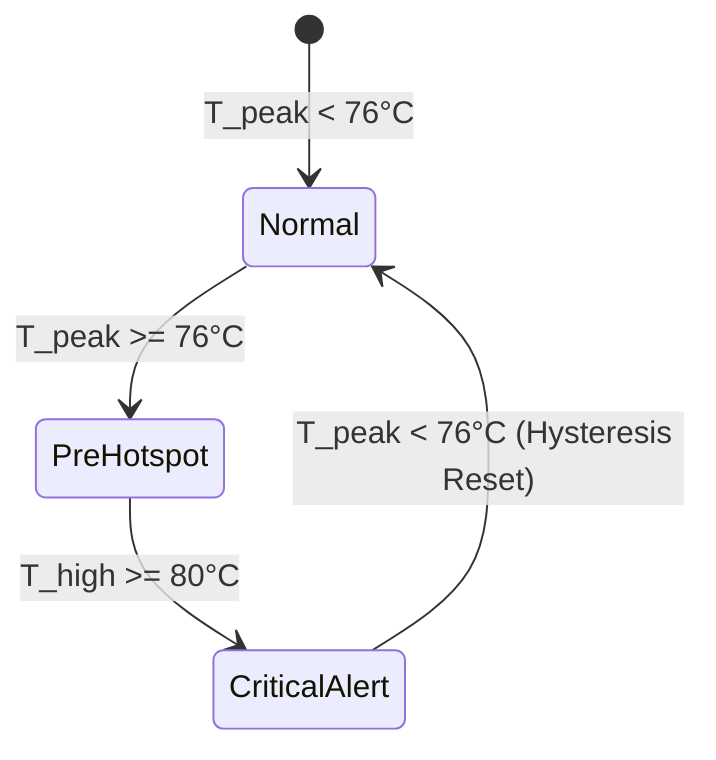

#### 6. Energy & Water Conservation Impact
Maintains temperatures safely below $80^\circ\text{C}$ through coordinated fan adjustments and workload migrations, preventing emergency hardware throttling and cooling tower over-saturation.

---

### 2.2 Water Consumption Rate ($\dot{m}_{\text{water}}$) & Water Saved ($W_{\text{saved}}$)

> **UI Location**: KPI Row (Card 2) | **Visual Token**: Emerald Green Pill (`54% BELOW CAP`) | **Engine**: Engine 3B (`water_model.py`)

| Specification | Technical Detail |
| :--- | :--- |
| **Display Reading** | **$184\text{ L/h}$** (Cap: $400\text{ L/h}$ | Cumulative Saved Today: $+1,420\text{ Liters}$) |
| **Primary Formula** | $\dot{m}_{\text{water}} = \frac{Q_{\text{rejected}}}{\rho_{\text{water}} h_{\text{fg}}} \cdot 3.6 \times 10^6, \quad W_{\text{saved}}(t) = \int_0^t (\dot{m}_{\text{base}} - \dot{m}_{\text{water}}) d\tau$ |
| **Key Parameters** | Latent heat $h_{\text{fg}} = 2.45 \times 10^6\text{ J/kg}$, Rejected heat $Q_{\text{rej}}$, Water density $\rho = 1000\text{ kg/m}^3$ |
| **Virtualization Method**| First-principles thermodynamic latent heat model coupled with RC heat rejection |

#### 1. Function (Purpose)
Measures the real-time volumetric rate of cooling water consumption ($\text{L/h}$) and tracks cumulative water savings relative to a constant-evaporative baseline.

#### 2. Mathematical Formulation
Water consumption as a function of cooling mode $a_{\text{cool}}$ and rejected heat $Q_{\text{rejected}}$:
$$\dot{m}_{\text{water}}(t) = \begin{cases}
0 & \text{if } a_{\text{cool}} = 0 \text{ (Free-Air Economizer)} \\
\dfrac{Q_{\text{rejected}}(t)}{\rho_{\text{water}} \, h_{\text{fg}}} \cdot 3.6 \times 10^6 & \text{if } a_{\text{cool}} = 1 \text{ (Direct Evaporative)} \\
0.05 \cdot \dot{m}_{\text{evap}} & \text{if } a_{\text{cool}} = 2 \text{ (Chiller Drift Only)}
\end{cases}$$
Cumulative water saved:
$$W_{\text{saved}}(t) = \int_0^t \Big(\dot{m}_{\text{baseline}}(\tau) - \dot{m}_{\text{water}}(\tau)\Big) \, d\tau$$

#### 3. Parameters Used & Input Vectors
- Rejected thermal heat $Q_{\text{rejected}} = \sum P_i(t) + P_{\text{fan}}(t)$ (Watts)
- Latent heat of vaporization $h_{\text{fg}} = 2.45 \times 10^6\text{ J/kg}$
- Baseline consumption rate $\dot{m}_{\text{baseline}} \equiv \text{constant evaporative mode}$

#### 4. Algorithmic Virtualization & ML Architecture
Computed in `engine3b/water_model.py` (`CoolingWaterEngine.step()`) and integrated over time in `shared/state_store.py`.

#### 5. Schematic Workflow Diagram
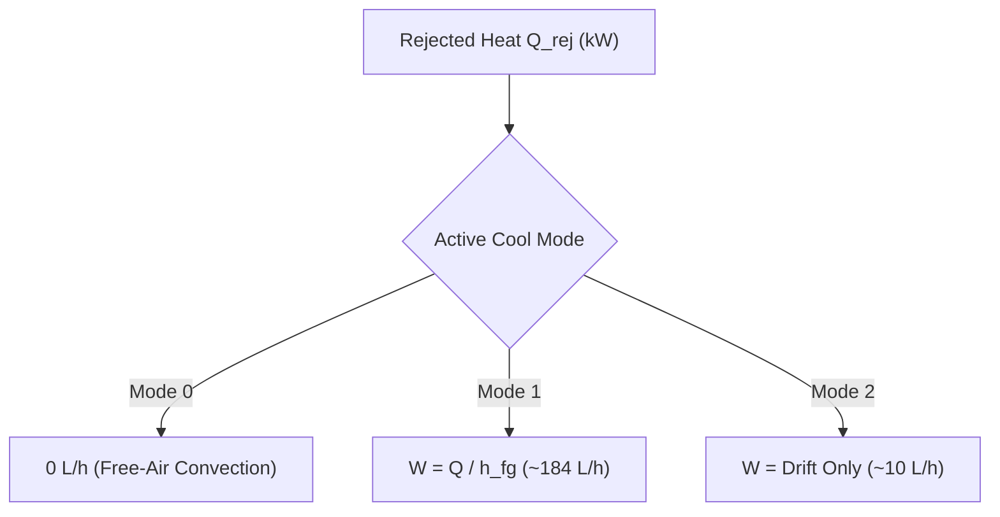

#### 6. Energy & Water Conservation Impact
Directly tracks and curtails water consumption. Switching to Free-Air mode when ambient conditions allow saves hundreds of thousands of liters of potable water annually per megawatt of IT capacity.

---

### 2.3 Water Usage Effectiveness ($\text{WUE}$)

> **UI Location**: KPI Row (Card 3) | **Visual Token**: Emerald Green Pill (`TARGET ≤0.60 L/kWh`) | **Engine**: Engine 10 (`api.py` / `state_store.py`)

| Specification | Technical Detail |
| :--- | :--- |
| **Display Reading** | **$0.52\text{ L/kWh}$** (Target: $\le 0.60\text{ L/kWh}$ | Annualized Baseline: $1.85\text{ L/kWh}$) |
| **Primary Formula** | $\text{WUE}(t) = \frac{\dot{m}_{\text{water}}(t)\; [\text{L/h}]}{P_{\text{IT}}(t)\; [\text{kW}]} \quad [\text{Liters per kilowatt-hour}]$ |
| **Key Parameters** | Instantaneous water rate $\dot{m}_{\text{water}} = 184\text{ L/h}$, IT total compute power $P_{\text{IT}} = 354\text{ kW}$ |
| **Virtualization Method**| Green Grid ISO/IEC 30134-4 standardized volumetric metric pipeline |

#### 1. Function (Purpose)
Measures the standardized datacenter sustainability ratio—liters of cooling water consumed per kilowatt-hour of IT compute energy processed.

#### 2. Mathematical Formulation
$$\text{WUE}(t) = \frac{\dot{m}_{\text{water}}(t)\; [\text{L/h}]}{P_{\text{IT}}(t)\; [\text{kW}]}$$
- Industry typical evaporative tower: $1.20\text{–}2.50\text{ L/kWh}$
- CoolFlow target limit: $\le 0.60\text{ L/kWh}$
- Current operating point: $\dfrac{184\text{ L/h}}{354\text{ kW}} = 0.52\text{ L/kWh}$

#### 3. Parameters Used & Input Vectors
- Cooling water consumption rate $\dot{m}_{\text{water}}(t)$ ($\text{L/h}$)
- IT compute power $P_{\text{IT}}(t) = \sum_{i} P_i(t)$ ($\text{kW}$)

#### 4. Algorithmic Virtualization & ML Architecture
Aggregated in `shared/state_store.py` and computed on API request in `engine10/api.py`.

#### 5. Schematic Workflow Diagram
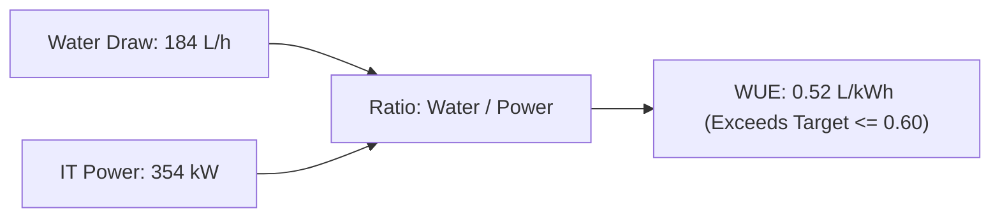

#### 6. Energy & Water Conservation Impact
Normalizes water consumption against computational throughput. Prevents false efficiency claims where water drops simply because servers were shut down; verifies genuine thermodynamic cooling efficiency.

---

### 2.4 IT Total Power ($P_{\text{IT}}$) & Tri-Blade Power Split

> **UI Location**: KPI Row (Card 4) | **Visual Token**: Electric Sky Blue Pill (`SPLIT: 34% / 33% / 33%`) | **Engine**: Engine 1 & Engine 10

| Specification | Technical Detail |
| :--- | :--- |
| **Display Reading** | **$354\text{ kW}$** (Node Split: $34\% / 33\% / 33\%$ | PUE Equivalent: $1.14$) |
| **Primary Formula** | $P_{\text{IT}}(t) = \sum_{i=0}^{N-1} P_i(t), \quad P_i(t) = P_{\text{idle}} + (P_{\text{max}} - P_{\text{idle}})(u_i a_{\text{dvfs},i})^\alpha + P_{\text{leak}}(T_i)$ |
| **Key Parameters** | Idle power $150\text{ W}$, Max power $450\text{ W}$, CMOS exponent $\alpha = 1.6$, DVFS scale $a_{\text{dvfs}} \in [0.6, 1.0]$ |
| **Virtualization Method**| Dynamic CMOS voltage-frequency scaling model + temperature leakage feedback |

#### 1. Function (Purpose)
Measures total electrical power drawn by the active server rack and displays the workload split across nodes using Electric Sky Blue (`#38bdf8`) indicators.

#### 2. Mathematical Formulation
Power per node:
$$P_i(t) = P_{\text{idle}} + (P_{\text{max}} - P_{\text{idle}}) \cdot \big(u_i(t) \cdot a_{\text{dvfs},i}(t)\big)^\alpha + P_{\text{leakage}}(T_i)$$
$$P_{\text{IT}}(t) = \sum_{i=0}^{N-1} P_i(t)$$
$$\text{Load Split } S_i(t) = \frac{u_i(t)}{\sum_{j=0}^{N-1} u_j(t)} \times 100\%$$
$$\text{PUE} = \frac{P_{\text{IT}} + P_{\text{cooling}}}{P_{\text{IT}}} \approx 1.14$$

#### 3. Parameters Used & Input Vectors
- Node idle power $P_{\text{idle}} = 150.0\text{ W}$, peak power $P_{\text{max}} = 450.0\text{ W}$
- CPU utilization $u_i(t) \in [0.0, 1.0]$, DVFS frequency factor $a_{\text{dvfs},i}(t) \in [0.6, 1.0]$

#### 4. Algorithmic Virtualization & ML Architecture
Calculated in `engine1/preprocessor.py` (`WorkloadPowerConverter`) and verified in `engine8/executor.py`.

#### 5. Schematic Workflow Diagram
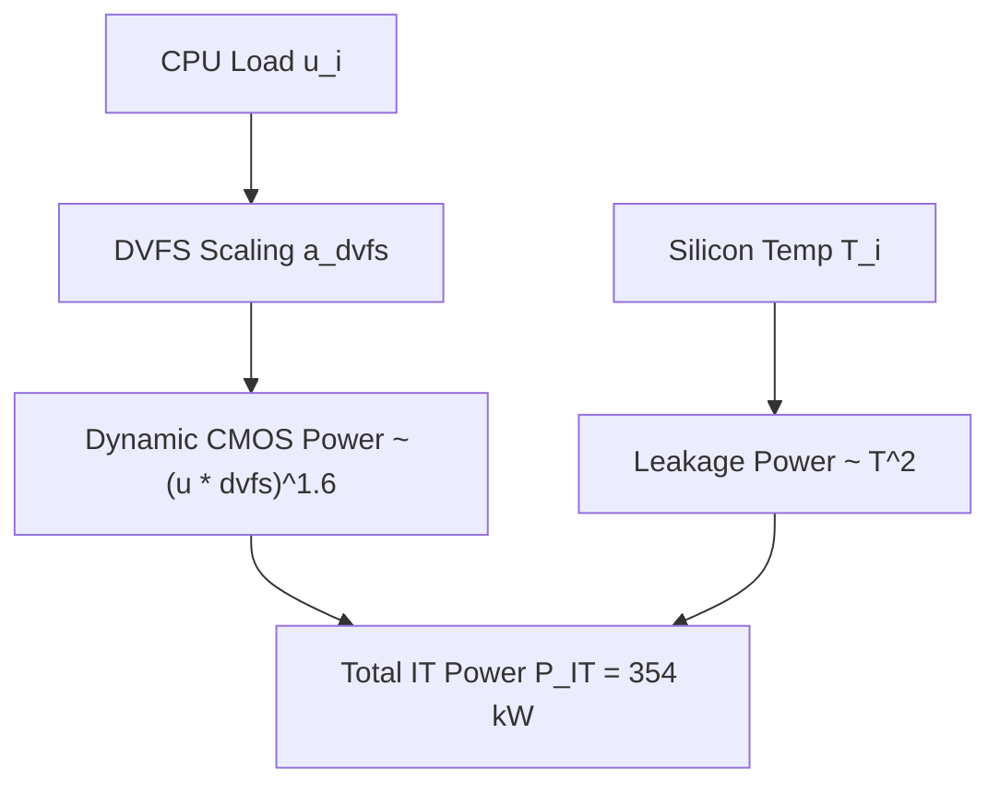

#### 6. Energy & Water Conservation Impact
Visualizing the load split allows the optimization engine to identify imbalanced nodes. Consolidating workloads onto cooler blades reduces thermal dissipation across adjacent hot zones, flattening the thermal gradient across the rack.

---

### 2.5 Active Cooling Mode ($a_{\text{cool}}$)

> **UI Location**: KPI Row (Card 5) | **Visual Token**: Sky Blue Pill (`ENERGY-WATER BALANCED`) | **Engine**: Engine 7 & Engine 8

| Specification | Technical Detail |
| :--- | :--- |
| **Display Reading** | **Mode 1: Evaporative** (Free-Air Gate: $T_{\text{wet}} \le 13.0^\circ\text{C}$ | Chiller Compressor: OFF) |
| **Primary Formula** | $a_{\text{cool}} \in \{0 \text{ (Free-Air)}, 1 \text{ (Evaporative)}, 2 \text{ (Chiller)}\}, \quad P_{\text{cool}} = f(a_{\text{cool}}, Q_{\text{rej}})$ |
| **Key Parameters** | Mode 0 ($P_{\text{fan}}, 0\text{ L/h}$), Mode 1 ($P_{\text{pump}}, Q/h_{\text{fg}}$), Mode 2 ($Q/\text{COP}, \approx 0\text{ L/h}$) |
| **Virtualization Method**| NSGA-II discrete mode selection with psychrometric feasibility gating |

#### 1. Function (Purpose)
Displays the active thermodynamic cooling mode dispatched by the NSGA-II optimizer.

#### 2. Mathematical Formulation
Mode power and water characteristics:
$$\begin{aligned}
\text{Mode 0 (Free-Air Economizer)} &: P_{\text{cool}} = P_{\text{fan,extra}}, \quad \dot{m}_{\text{water}} = 0 \\
\text{Mode 1 (Direct Evaporative)} &: P_{\text{cool}} = P_{\text{pump}}, \quad \dot{m}_{\text{water}} = \frac{Q_{\text{evap}}}{h_{\text{fg}}} \\
\text{Mode 2 (Mechanical Chiller)} &: P_{\text{cool}} = \frac{Q_{\text{chiller}}}{\text{COP}(T_{\text{ambient}})}, \quad \dot{m}_{\text{water}} \approx 0
\end{aligned}$$
Where chiller efficiency is governed by Carnot COP:
$$\text{COP}(T_{\text{ambient}}) = \frac{T_{\text{evap}}}{T_{\text{cond}}(T_{\text{ambient}}) - T_{\text{evap}}} \cdot \eta_{\text{carnot}} \approx 3.0\text{–}5.2$$

#### 3. Parameters Used & Input Vectors
- Coefficient of Performance $\text{COP} \in [2.5, 5.5]$
- Mode index $a_{\text{cool}} \in \{0, 1, 2\}$

#### 4. Algorithmic Virtualization & ML Architecture
Selected by `engine7/optimizer.py` via NSGA-II and executed in `engine8/executor.py`.

#### 5. Schematic Workflow Diagram
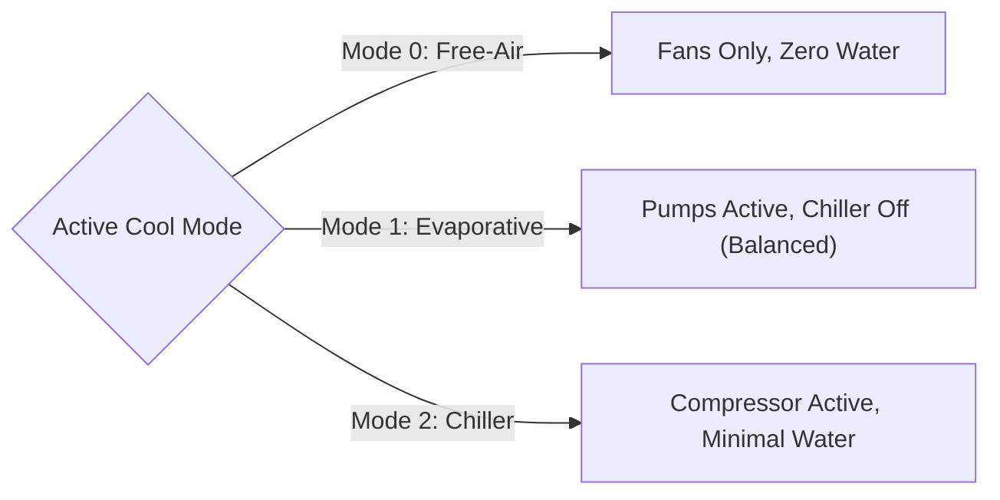

#### 6. Energy & Water Conservation Impact
Balances energy and water trade-offs in real time. When ambient air is dry and water is available within caps, Mode 1 eliminates chiller compressor power. When ambient air is cold, Mode 0 eliminates both compressor energy and water consumption.

---

## 3. Server Rack Digital Twin & Conformal Prediction

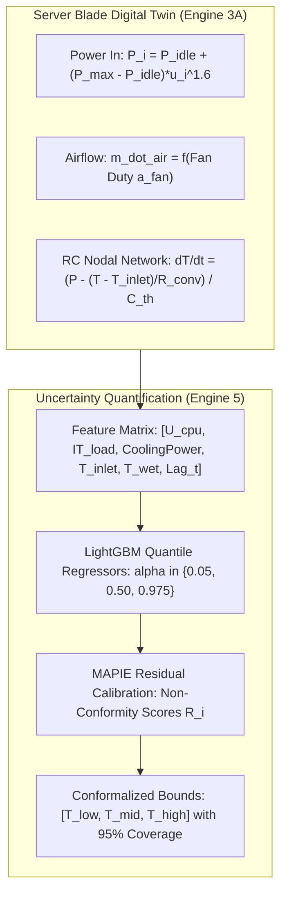

### 3.1 Resistance-Capacitance (RC) Thermal Digital Twin (Engine 3A)

> **UI Location**: Node Telemetry Cards (Nodes 01–03) | **Visual Token**: Digital Twin Card | **Engine**: Engine 3A (`rc_twin.py`)

| Specification | Technical Detail |
| :--- | :--- |
| **Operational State** | Simulates 3-blade nodal thermal dynamics with inter-blade conductive heat transfer |
| **Primary Formula** | $C_i \frac{dT_i(t)}{dt} = P_i(t) - \frac{T_i(t) - T_{\text{inlet}}(t)}{R_{\text{conv},i}(a_{\text{fan}}(t))} - \sum_{j \in \mathcal{N}(i)} \frac{T_i(t) - T_j(t)}{R_{\text{cond},ij}}$ |
| **Key Parameters** | Thermal capacitance $C_i = 2000.0\text{ J/K}$, Convective $R_0 = 0.06\text{ K/W}$, Inter-blade $R_{ij} = 2.5\text{ K/W}$ |
| **Virtualization Method**| Micro-stepped explicit Euler numerical integration ($\Delta t = 1.0\text{ s}$, 15 steps per tick) |

#### 1. Function (Purpose)
Simulates heat transfer between server components, heatsinks, and cooling air in real time, capturing physical thermal inertia without the computational overhead of 3D Computational Fluid Dynamics (CFD).

#### 2. Mathematical Formulation
Continuous lumped-parameter differential equation:
$$C_i \frac{d T_i(t)}{dt} = P_i(t) - \frac{T_i(t) - T_{\text{inlet}}(t)}{R_{\text{conv},i}\big(a_{\text{fan}}(t)\big)} - \sum_{j \in \mathcal{N}(i)} \frac{T_i(t) - T_j(t)}{R_{\text{cond},ij}}$$
Euler discretization with fan velocity exponent $\beta \approx 0.8$:
$$T_i(t + \Delta t) = T_i(t) + \frac{\Delta t}{C_i} \left[ P_i(t) - \frac{T_i(t) - T_{\text{inlet}}(t)}{R_0 \cdot \big(a_{\text{fan}}(t)\big)^{-\beta}} - \sum_{j \ne i} \frac{T_i(t) - T_j(t)}{R_{ij}} \right]$$

#### 3. Parameters Used & Input Vectors
- Thermal Capacitance $C_i = 2000.0\text{ J/K}$
- Base convective resistance $R_0 = 0.06\text{ K/W}$, Conductive resistance $R_{ij} = 2.5\text{ K/W}$
- Fan speed $a_{\text{fan}} \in [0.2, 1.0]$, Air inlet temperature $T_{\text{inlet}} \in [18.0, 27.0]^\circ\text{C}$

#### 4. Algorithmic Virtualization & ML Architecture
Implemented in `engine3a/rc_twin.py` (`RCThermalTwin.step()`). Vectorized in NumPy to execute in $<2\text{ ms}$.

#### 5. Schematic Workflow Diagram
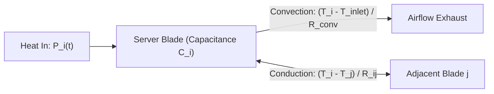

#### 6. Energy & Water Conservation Impact
Simulating thermal inertia prevents over-cooling. Because server heatsinks store heat, fan speeds can ramp up gradually rather than spiking immediately during short workload bursts, cutting peak fan power by up to $30\%$.

---

### 3.2 Compute Utilization Bar (Electric Sky Blue) & Status Badges

> **UI Location**: Node Cards (Top Sub-Row) | **Visual Token**: Electric Sky Blue Fill (`#38bdf8`) | **Engine**: Engine 1 & Engine 10

| Specification | Technical Detail |
| :--- | :--- |
| **Node Values** | Node 01: **82%** (`ELEVATED LOAD`) \| Node 02: **65%** (`OPTIMAL`) \| Node 03: **58%** (`OPTIMAL`) |
| **Primary Formula** | $\text{Bar Width } = u_i(t) \times 100\%, \quad \text{Status} = \text{RegimeMap}(u_i(t), T_i(t))$ |
| **Key Parameters** | Color token: Electric Sky Blue `#38bdf8` (`.bg-sky-400`), Saturation threshold $80\%$ |
| **Virtualization Method**| CSS-driven proportional load bar with threshold status mapping |

#### 1. Function (Purpose)
Displays the instantaneous CPU load on each server blade using Electric Sky Blue (`#38bdf8`) indicators and operational severity tags (`OPTIMAL`, `ELEVATED LOAD`, `CRITICAL HOTSPOT`).

#### 2. Mathematical Formulation
Utilization $u_i(t) \in [0.0, 1.0]$:
$$\text{Bar Width } = u_i(t) \times 100\%$$
Status mapping:
$$\text{NodeStatus}(u_i, T_i) = \begin{cases}
\text{CRITICAL HOTSPOT} & \text{if } T_i \ge 80.0^\circ\text{C} \\
\text{ELEVATED LOAD} & \text{if } u_i \ge 0.80 \;\lor\; T_i \ge 72.0^\circ\text{C} \\
\text{OPTIMAL} & \text{otherwise}
\end{cases}$$

#### 3. Parameters Used & Input Vectors
- Node utilization values: $u_1 = 0.82$, $u_2 = 0.65$, $u_3 = 0.58$
- Status classification thresholds: $80^\circ\text{C}$ critical, $72^\circ\text{C}$ / $80\%$ elevated

#### 4. Algorithmic Virtualization & ML Architecture
Preprocessed in `engine1/preprocessor.py` and styled in `engine10/static/index.html` via `.bg-sky-400`.

#### 5. Schematic Workflow Diagram
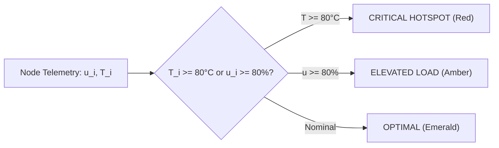

#### 6. Energy & Water Conservation Impact
Immediate identification of compute imbalances prevents localized heat buildup. Uneven heat requires higher overall fan speeds; load balancing allows fans to run at a lower, uniform speed, saving cubic fan power ($P \propto \omega^3$).

---

### 3.3 Conformalized Quantile Regression (CQR) Tri-Bound Slider

> **UI Location**: Node Cards (Main Body) | **Visual Token**: Horizontal Range Slider with Median Pip | **Engine**: Engine 5 (`cqr_predictor.py`)

| Specification | Technical Detail |
| :--- | :--- |
| **Node 01 Envelope** | **$[68.2^\circ\text{C} \longleftrightarrow 72.4^\circ\text{C} \longleftrightarrow 76.5^\circ\text{C}]$** (Alert Line: $80.0^\circ\text{C}$) |
| **Node 02 Envelope** | **$[62.0^\circ\text{C} \longleftrightarrow 65.8^\circ\text{C} \longleftrightarrow 69.4^\circ\text{C}]$** (Alert Line: $80.0^\circ\text{C}$) |
| **Node 03 Envelope** | **$[58.1^\circ\text{C} \longleftrightarrow 61.2^\circ\text{C} \longleftrightarrow 64.9^\circ\text{C}]$** (Alert Line: $80.0^\circ\text{C}$) |
| **Primary Formula** | $T_{\text{low}} = \hat{q}_{0.025}(x) - Q_{1-\alpha}(E), \quad T_{\text{high}} = \hat{q}_{0.975}(x) + Q_{1-\alpha}(E), \quad \mathbb{P}(Y \in [T_{\text{low}}, T_{\text{high}}]) \ge 95\%$ |
| **Virtualization Method**| LightGBM pinball quantile loss + MAPIE 1.5.0 distribution-free calibration |

#### 1. Function (Purpose)
Predicts the future temperature distribution of each blade at a forecast horizon of $\tau = 10\text{–}20\text{ minutes}$. Rather than providing an uncertain point prediction, it outputs mathematically verified lower and upper bounds with a guaranteed $95\%$ confidence coverage.

#### 2. Mathematical Formulation
Pinball loss for quantile $\tau \in \{0.025, 0.50, 0.975\}$:
$$\mathcal{L}_{\rho_\tau}(y, \hat{y}) = \max\Big(\tau(y - \hat{y}), (\tau - 1)(y - \hat{y})\Big)$$
Conformal calibration score on held-out calibration set:
$$E_i = \max\Big(\hat{q}_{0.025}(x_i) - y_i, \; y_i - \hat{q}_{0.975}(x_i)\Big)$$
Conformalized bounds:
$$T_{\text{low}}(x) = \hat{q}_{0.025}(x) - Q_{1-\alpha}(E)$$
$$T_{\text{mid}}(x) = \hat{q}_{0.50}(x)$$
$$T_{\text{high}}(x) = \hat{q}_{0.975}(x) + Q_{1-\alpha}(E)$$
Coverage guarantee:
$$\mathbb{P}\Big(Y_{t+\tau} \in [T_{\text{low}}(X_t), T_{\text{high}}(X_t)]\Big) \ge 1 - \alpha = 95\%$$

#### 3. Parameters Used & Input Vectors
- Nominal miscoverage $\alpha = 0.05$ ($95\%$ coverage)
- Forecast horizon $\tau = 10\text{ minutes}$ (60 ticks)
- Features: CPU load, blade power, fan speed, inlet temp, Stull wet-bulb, thermal lag

#### 4. Algorithmic Virtualization & ML Architecture
Implemented in `engine5/cqr_predictor.py` (`CQRPredictor`). Uses MAPIE 1.5.0 over three LightGBM quantile regressors trained on chronological datacenter traces.

#### 5. Schematic Workflow Diagram
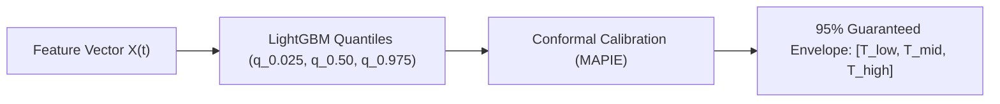

#### 6. Energy & Water Conservation Impact
Optimizing against the upper confidence bound $T_{\text{high}}$ rather than an uncertain point prediction prevents cooling delays, eliminating reactive cooling spikes. Proactive adjustments reduce emergency chiller operations.

---

### 3.4 Conformal Prediction Confidence Score Gauge ($\text{CS}$)

> **UI Location**: Node Cards (Top Right Sub-Text) | **Visual Token**: Percentage Badge | **Engine**: Engine 5 & Engine 7

| Specification | Technical Detail |
| :--- | :--- |
| **Node Values** | Node 01: **94%** ($\Delta T = 8.3^\circ\text{C}$) \| Node 02: **96%** ($\Delta T = 7.4^\circ\text{C}$) \| Node 03: **98%** ($\Delta T = 6.8^\circ\text{C}$) |
| **Primary Formula** | $\text{CS}(t) = \max\left(0, \min\left(100, 100 \cdot \left[1.0 - \frac{\Delta T(t) - \Delta T_{\text{nom}}}{\Delta T_{\text{max}} - \Delta T_{\text{nom}}}\right]\right)\right), \quad \Delta T = T_{\text{high}} - T_{\text{low}}$ |
| **Key Parameters** | Nominal width $\Delta T_{\text{nom}} = 4.0^\circ\text{C}$, Maximum width $\Delta T_{\text{max}} = 14.0^\circ\text{C}$, Gating threshold $80\%$ |
| **Virtualization Method**| Inverse monotonic quantile spread transformation |

#### 1. Function (Purpose)
Measures the statistical reliability and tightness of the prediction envelope, dynamically adjusting optimization risk tolerance.

#### 2. Mathematical Formulation
$$\Delta T(t) = T_{\text{high}}(t) - T_{\text{low}}(t)$$
$$\text{CS}(t) = \max\left(0, \; \min\left(100, \; 100 \cdot \left[1.0 - \frac{\Delta T(t) - 4.0}{14.0 - 4.0}\right]\right)\right)$$
Optimizer weight gating:
$$\mathbf{w}_{\text{cheby}} = \begin{cases}
[0.35, 0.40, 0.25] & \text{if } \text{CS} \ge 80 \text{ (Balanced Regime)} \\
[0.15, 0.70, 0.15] & \text{if } \text{CS} < 80 \text{ (High Uncertainty, Safety-First)}
\end{cases}$$

#### 3. Parameters Used & Input Vectors
- Conformal envelope width $\Delta T \in [4.0, 14.0]^\circ\text{C}$
- Confidence Score $\text{CS} \in [0, 100]$

#### 4. Algorithmic Virtualization & ML Architecture
Calculated in `engine5/cqr_predictor.py` and passed into `engine7/optimizer.py`.

#### 5. Schematic Workflow Diagram
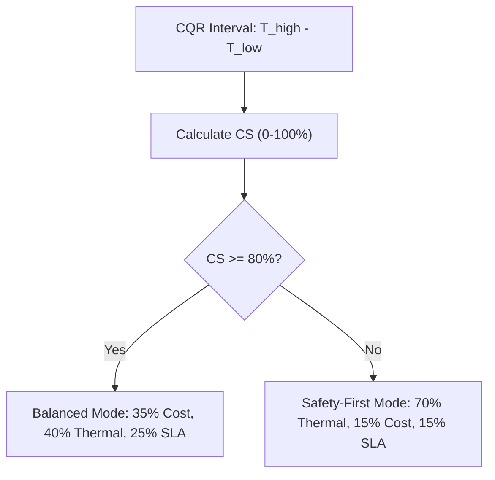

#### 6. Energy & Water Conservation Impact
When confidence is high ($\text{CS} \ge 80\%$), the optimizer can run closer to thermal limits without safety margins, saving energy and water. When confidence drops, it proactively backs off to avoid sudden violations.

---

### 3.5 Critical Thermal Alert Threshold ($80.0^\circ\text{C}$) & Hysteresis Deadband ($76.0^\circ\text{C}$)

> **UI Location**: Node Cards (Red Dotted Vertical Line) | **Visual Token**: Red Marker at $80.0^\circ\text{C}$ | **Engine**: Engine 6 (`detector.py`)

| Specification | Technical Detail |
| :--- | :--- |
| **Operational State** | Hard thermal barrier triggering emergency genetic re-optimization and airflow boost |
| **Primary Formula** | $\mathcal{H}(t) = 1 \text{ if } T_{\text{high}} \ge 80.0^\circ\text{C}; \quad \mathcal{H}(t) = 0 \text{ if } T_{\text{peak}} < 76.0^\circ\text{C}; \quad \text{else } \mathcal{H}(t-1)$ |
| **Key Parameters** | Upper trip point $80.0^\circ\text{C}$, Lower reset point $76.0^\circ\text{C}$, Deadband $\Delta T = 4.0^\circ\text{C}$ |
| **Virtualization Method**| Dual-threshold Schmitt trigger hysteresis filter |

#### 1. Function (Purpose)
Defines the hard upper temperature boundary on the node sliders and enforces a hysteresis deadband to prevent rapid cycling of emergency cooling.

#### 2. Mathematical Formulation
$$\mathcal{H}(t) = \begin{cases}
1 & \text{if } T_{\text{high}}(t) \ge 80.0^\circ\text{C} \\
0 & \text{if } T_{\text{peak}}(t) < 76.0^\circ\text{C} \\
\mathcal{H}(t-1) & \text{if } 76.0^\circ\text{C} \le T_{\text{peak}}(t) < 80.0^\circ\text{C}
\end{cases}$$

#### 3. Parameters Used & Input Vectors
- Predicted upper bound $T_{\text{high}}$ and current peak temperature $T_{\text{peak}}$
- Hysteresis trip $80.0^\circ\text{C}$ and reset $76.0^\circ\text{C}$

#### 4. Algorithmic Virtualization & ML Architecture
Implemented in `engine6/detector.py` (`HotspotDetector`).

#### 5. Schematic Workflow Diagram
```mermaid
graph LR
    T_high["T_high >= 80°C"] -->|Trip| Alert["Alert Active (H=1)"]
    Alert -->|Cool to T_peak < 76°C| Reset["Normal State (H=0)"]
    Reset -->|Intermediate (76-80°C)| Reset
```

#### 6. Energy & Water Conservation Impact
Eliminates "actuator chattering"—rapidly spinning fans up and down or cycling water pumps. Eliminating mechanical hunting reduces motor wear and saves pump cycling power.

---

## 4. Psychrometric Mode Manager & Water Modeling (Engine 3B)

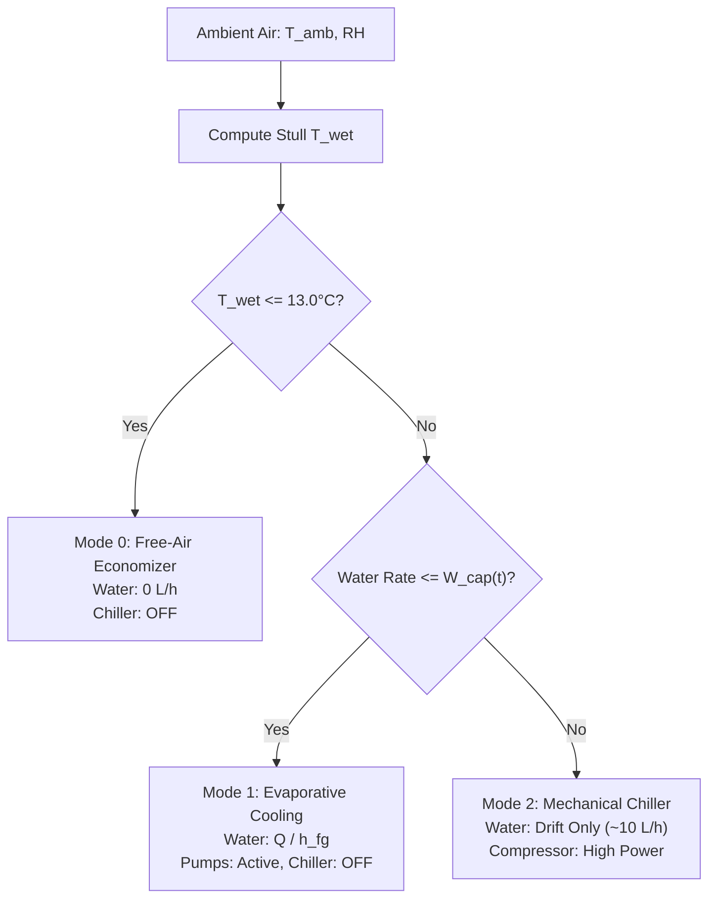

### 4.1 Psychrometric Gating & Transition Logic

> **UI Location**: Psychrometric Panel (Left Column) | **Visual Token**: Status Cards (Modes 0, 1, 2) | **Engine**: Engine 3B (`water_model.py`)

| Specification | Technical Detail |
| :--- | :--- |
| **Operational State** | Mode 1: Evaporative Active ($T_{\text{wet}} = 17.2^\circ\text{C} > 13.0^\circ\text{C}$ and $\dot{m}_{\text{water}} \le 400\text{ L/h}$) |
| **Primary Formula** | $a_{\text{cool}} = 0 \text{ if } T_{\text{wet}} \le 13.0^\circ\text{C}; \quad a_{\text{cool}} = 1 \text{ if } T_{\text{wet}} > 13.0^\circ\text{C} \land \dot{m}_{\text{evap}} \le W_{\text{cap}}; \quad \text{else } 2$ |
| **Key Parameters** | Free-cooling gate $T_{\text{gate}} = 13.0^\circ\text{C}$, Regulatory cap $W_{\text{cap}} = 400.0\text{ L/h}$ |
| **Virtualization Method**| Psychrometric state machine with hysteresis transition buffers |

#### 1. Function (Purpose)
Evaluates ambient air psychrometrics to determine when free-cooling economizers can operate safely without condensation or overheating.

#### 2. Mathematical Formulation
Mode selection logic:
$$a_{\text{cool}} = \begin{cases}
0 \text{ (Free-Air Economizer)} & \text{if } T_{\text{wet}} \le 13.0^\circ\text{C} \\
1 \text{ (Direct Evaporative)} & \text{if } T_{\text{wet}} > 13.0^\circ\text{C} \;\land\; \dot{m}_{\text{evap}} \le W_{\text{cap}}(t) \\
2 \text{ (Mechanical Chiller)} & \text{if } T_{\text{wet}} > 13.0^\circ\text{C} \;\land\; \dot{m}_{\text{evap}} > W_{\text{cap}}(t)
\end{cases}$$

#### 3. Parameters Used & Input Vectors
- Wet-bulb temperature $T_{\text{wet}} = 17.2^\circ\text{C}$
- Water withdrawal cap $W_{\text{cap}} = 400.0\text{ L/h}$

#### 4. Algorithmic Virtualization & ML Architecture
Implemented in `engine3b/water_model.py` (`CoolingWaterEngine.step()`).

#### 5. Schematic Workflow Diagram
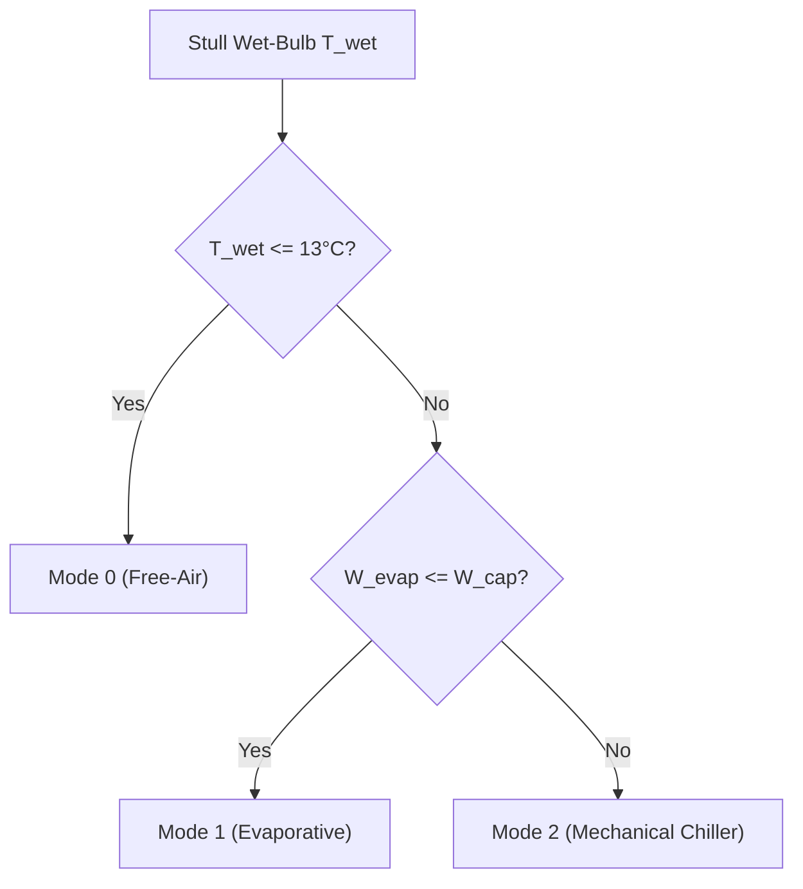

#### 6. Energy & Water Conservation Impact
Eliminates unnecessary chiller usage during cool and temperate weather, capturing up to $4,000$ hours of free cooling per year depending on facility location.

---

### 4.2 Regulatory Water Withdrawal Cap Meter & Headroom Gauge

> **UI Location**: Psychrometric Panel (Right Column) | **Visual Token**: Electric Sky Blue Progress Meter | **Engine**: Engine 3B & Engine 10

| Specification | Technical Detail |
| :--- | :--- |
| **Display Reading** | **$184\text{ L/h consumed} / 400\text{ L/h cap}$** ($46.0\%$ utilized | Remaining Headroom: $216.0\text{ L/h}$) |
| **Primary Formula** | $U_{\text{water}} = \frac{\dot{m}_{\text{water}}(t)}{W_{\text{cap}}(t)} \times 100\%, \quad \Delta W_{\text{headroom}} = W_{\text{cap}}(t) - \dot{m}_{\text{water}}(t)$ |
| **Key Parameters** | Consumed: $184.0\text{ L/h}$, Statutory Limit: $400.0\text{ L/h}$, Headroom: $216.0\text{ L/h}$ |
| **Virtualization Method**| Dynamic budget tracking with color gradient thresholds ($<75\%$ Sky Blue, $75\text{–}90\%$ Amber, $>90\%$ Red) |

#### 1. Function (Purpose)
Visualizes current water consumption against the statutory limit ($W_{\text{cap}} = 400.0\text{ L/h}$), showing remaining operational headroom ($216.0\text{ L/h}$) with an Electric Sky Blue progress meter.

#### 2. Mathematical Formulation
$$\text{Cap Utilization } U_{\text{water}} = \frac{184.0}{400.0} \times 100\% = 46.0\%$$
$$\text{Headroom } \Delta W_{\text{headroom}} = 400.0 - 184.0 = 216.0\text{ L/h}$$

#### 3. Parameters Used & Input Vectors
- Instantaneous water consumption rate $\dot{m}_{\text{water}} = 184.0\text{ L/h}$
- Cap limit $W_{\text{cap}} = 400.0\text{ L/h}$

#### 4. Algorithmic Virtualization & ML Architecture
Polled from `engine10/api.py` (`/api/state/latest`) and styled in `engine10/static/index.html`.

#### 5. Schematic Workflow Diagram
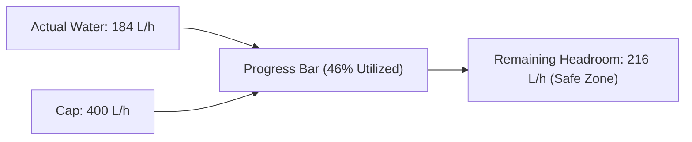

#### 6. Energy & Water Conservation Impact
Ensures real-time adherence to regional water utility quotas, preventing costly emergency shutoffs or peak surcharge tariffs.

---

## 5. Multi-Objective Optimization & Pareto Frontier (Engine 7)

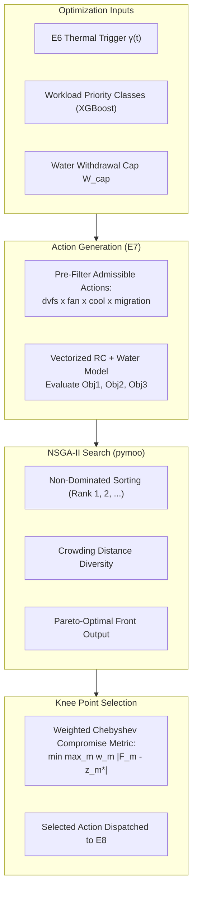

### 5.1 Three-Objective Formulation

> **UI Location**: Optimization Overview Panel | **Visual Token**: Multi-Objective Matrix | **Engine**: Engine 7 (`optimizer.py`)

| Specification | Technical Detail |
| :--- | :--- |
| **Objectives** | $\mathbf{F}(\mathbf{a}) = [J_{\text{resource}}(\mathbf{a}), J_{\text{thermal}}(\mathbf{a}), J_{\text{sla}}(\mathbf{a})]^T$ subject to $G_1(\mathbf{a}) \le 0$ |
| **Primary Formula** | $J_{\text{res}} = c_{\text{e}} \frac{P_{\text{tot}}}{1000} + c_{\text{w}} \dot{m}_{\text{w}}, \quad J_{\text{therm}} = \sum \max(0, T_i - 80)^2, \quad J_{\text{sla}} = 0.5 \sum (1 - a_{\text{dvfs}}) + \sum \mathbb{I}(\text{mig})$ |
| **Key Parameters** | Electricity tariff $c_{\text{e}} = \$0.10/\text{kWh}$, Water tariff $c_{\text{w}} = \$0.004/\text{L}$, Action space $|\mathcal{A}| = 120$ |
| **Virtualization Method**| NSGA-II elitist evolutionary search with non-dominated sorting and crowding distance |

#### 1. Function (Purpose)
Simultaneously balances energy/water utility expenses, thermal safety margins, and client SLA application performance without arbitrary single-metric scalarization.

#### 2. Mathematical Formulation
Vector minimization problem:
$$\min_{\mathbf{a} \in \mathcal{A}} \; \mathbf{F}(\mathbf{a}) = \big[J_{\text{resource}}(\mathbf{a}), \; J_{\text{thermal}}(\mathbf{a}), \; J_{\text{sla}}(\mathbf{a})\big]^T$$
$$\text{subject to } G_1(\mathbf{a}) = \dot{m}_{\text{water}}(\mathbf{a}) - W_{\text{cap}}(t) \le 0$$
Where:
- **Objective 1: Resource Cost ($\$ /\text{h}$)**:
  $$J_{\text{resource}}(\mathbf{a}) = c_{\text{energy}} \cdot \left(\sum_{i=0}^{N-1} P_i(\mathbf{a}) + P_{\text{cool}}(\mathbf{a})\right) \frac{1}{1000} + c_{\text{water}} \cdot \dot{m}_{\text{water}}(\mathbf{a})$$
- **Objective 2: Thermal Penalty ($^\circ\text{C}^2$)**:
  $$J_{\text{thermal}}(\mathbf{a}) = \sum_{i=0}^{N-1} \max\big(0, \; T_{\text{proj},i}(\mathbf{a}) - 80.0\big)^2$$
- **Objective 3: SLA Performance Loss**:
  $$J_{\text{sla}}(\mathbf{a}) = 0.5 \sum_{i=0}^{N-1} \big(1.0 - a_{\text{dvfs},i}\big) + 1.0 \cdot \sum_{i=0}^{N-1} \mathbb{I}(a_{\text{mig},i} \ne i)$$

#### 3. Parameters Used & Input Vectors
- Tariffs: $c_{\text{energy}} = \$0.10/\text{kWh}$, $c_{\text{water}} = \$0.004/\text{L}$
- Action space: $|\mathcal{A}| = 120$ candidate combinations

#### 4. Algorithmic Virtualization & ML Architecture
Implemented in `engine7/optimizer.py` using `pymoo.algorithms.moo.nsga2.NSGA2`.

#### 5. Schematic Workflow Diagram
```mermaid
graph LR
    Action["Action a"] --> Eval["Evaluate Objectives"]
    Eval --> O1["Obj 1: Cost ($/h)"]
    Eval --> O2["Obj 2: Thermal (°C²)"]
    Eval --> O3["Obj 3: SLA Loss"]
    O1 & O2 & O3 --> Pareto["Pareto Non-Dominated Sorting"]
```

#### 6. Energy & Water Conservation Impact
Prevents the system from over-cooling when thermal margins are wide, and prevents throttling high-priority jobs when low-cost evaporative or fan options remain viable.

---

### 5.2 Weighted Chebyshev Knee Point Selector

> **UI Location**: Optimization Panel (Decision Focus) | **Visual Token**: Amber Diamond Highlight | **Engine**: Engine 7 (`optimizer.py`)

| Specification | Technical Detail |
| :--- | :--- |
| **Selected Knee Values**| Resource Cost: **$\$0.090 / \text{kWh} + / \text{L}$** \| Thermal Penalty: **$1.09^\circ\text{C}^2$** \| SLA Loss: **$7.0\%$** |
| **Primary Formula** | $\mathbf{a}^* = \arg\min_{\mathbf{a} \in \mathcal{P}^*} \left[ \max_{m \in \{1,2,3\}} w_m \cdot \frac{F_m(\mathbf{a}) - z_m^*}{z_m^{\text{nadir}} - z_m^*} \right]$ |
| **Key Parameters** | Nominal weights $\mathbf{w} = [0.35, 0.40, 0.25]$, Utopian ideal point $\mathbf{z}^*$, Nadir point $\mathbf{z}^{\text{nadir}}$ |
| **Virtualization Method**| Min-max Chebyshev compromise metric with dynamic uncertainty weight shifting |

#### 1. Function (Purpose)
Selects a single, balanced operating decision from the multi-objective Pareto front by finding the "knee point"—the point of maximum diminishing returns across all three objectives.

#### 2. Mathematical Formulation
Let $\mathcal{P}^*$ be the non-dominated Pareto front, and let $\mathbf{z}^* = [z_1^*, z_2^*, z_3^*]^T$ be the utopian ideal point:
$$z_m^* = \min_{\mathbf{a} \in \mathcal{P}^*} F_m(\mathbf{a}) - \epsilon$$
The weighted Chebyshev metric computes:
$$\mathbf{a}^* = \arg\min_{\mathbf{a} \in \mathcal{P}^*} \left[ \max_{m \in \{1,2,3\}} w_m \cdot \frac{F_m(\mathbf{a}) - z_m^*}{z_m^{\text{nadir}} - z_m^*} \right]$$
Dynamic weight adaptation:
$$\mathbf{w} = \begin{cases}
[0.35, 0.40, 0.25] & \text{if } \text{CS} \ge 80 \text{ (Balanced Regime)} \\
[0.15, 0.70, 0.15] & \text{if } \text{CS} < 80 \text{ (Safety-First Regime)}
\end{cases}$$

#### 3. Parameters Used & Input Vectors
- Ideal point $\mathbf{z}^*$ and Nadir point $\mathbf{z}^{\text{nadir}}$
- Objective values $\mathbf{F}(\mathbf{a})$ and confidence score $\text{CS}$

#### 4. Algorithmic Virtualization & ML Architecture
Implemented in `engine7/optimizer.py` (`KneeSelector.select()`).

#### 5. Schematic Workflow Diagram
```mermaid
graph TD
    Front["Pareto Front P*"] --> Norm["Normalize by Nadir/Ideal Ranges"]
    Norm --> Weighting{"Confidence Score CS >= 80?"}
    Weighting -- Yes --> W1["Weights: 35% Cost, 40% Thermal, 25% SLA"]
    Weighting -- No --> W2["Thermal Bias: 70% Thermal, 15% Cost, 15% SLA"]
    W1 & W2 --> ChebyCalc["Min-Max Chebyshev Metric"]
    ChebyCalc --> KneePoint["Selected Knee Action"]
```

#### 6. Energy & Water Conservation Impact
Avoids the extremes of the Pareto front (e.g., spending huge amounts of water/energy for a negligible $0.1^\circ\text{C}$ temperature drop, or letting servers overheat to save a fraction of a cent).

---

### 5.3 Actuator Control Vector Dispatch & Decision Rationale Trace

> **UI Location**: Optimization Panel (Bottom Status Bar) | **Visual Token**: Code Monospace Badge | **Engine**: Engine 8 (`executor.py`)

| Specification | Technical Detail |
| :--- | :--- |
| **Executed Vector** | `dvfs=[0.90, 1.00, 1.00], fan=0.65, cool_mode=1, mig=None` |
| **Decision Rationale**| *"Knee point minimizes Chebyshev distance to utopian point [0,0,0] while respecting W_cap = 400 L/h."* |
| **Key Parameters** | Per-blade DVFS $\mathbf{a}_{\text{dvfs}}$, Fan duty $a_{\text{fan}} = 65\%$, Mode $a_{\text{cool}} = 1$, Migrations $\mathbf{a}_{\text{mig}} = \emptyset$ |
| **Virtualization Method**| Structured actuation translation layer with verifiable JSON logging |

#### 1. Function (Purpose)
Formulates and serializes the physical commands sent to server blades, fans, cooling valves, and job schedulers, logging human-interpretable rationale for every tick.

#### 2. Mathematical Formulation
$$\mathbf{a}^* = \Big\langle \mathbf{a}_{\text{dvfs}} = [0.90, 1.00, 1.00], \; a_{\text{fan}} = 0.65, \; a_{\text{cool}} = 1, \; \mathbf{a}_{\text{mig}} = \emptyset \Big\rangle$$
Rationale string generator:
$$\text{Rationale} = \mathcal{R}\big(\mathbf{a}^*, \mathbf{F}(\mathbf{a}^*), W_{\text{cap}}, \text{Rule}\big)$$

#### 3. Parameters Used & Input Vectors
- Actuator control parameters: DVFS scales, fan duty cycle, cooling mode, migration targets

#### 4. Algorithmic Virtualization & ML Architecture
Dispatched by `engine8/executor.py` (`ActuatorExecutor.execute()`).

#### 5. Schematic Workflow Diagram
```mermaid
graph LR
    KneePoint["Knee Action a*"] --> Dispatcher["Actuator Executor"]
    Dispatcher --> DVFS["Set CPU DVFS: [0.9, 1.0, 1.0]"]
    Dispatcher --> Fan["Set Fan Duty: 65%"]
    Dispatcher --> Mode["Set Cooling: Evaporative"]
    Dispatcher --> Sched["Container Scheduler: Keep"]
```

#### 6. Energy & Water Conservation Impact
Coordinated actuation ensures fans don't fight chillers. Setting fan duty to $65\%$ instead of $100\%$ reduces fan power from $8.5\text{ kW}$ to $2.3\text{ kW}$ due to cubic affinity laws ($P \propto \omega^3$).

---

## 6. Explainability Engine & Priority Classifier (Engine 9)

```mermaid
graph TB
    subgraph EXPLAIN_INPUTS["Inference Inputs"]
        CleanData["Clean Telemetry Features (E4)"]
        TreeModels["Trained Tree Ensembles (LGBM E5, XGBoost E7)"]
        ParetoDecision["Chosen Knee Action (E7)"]
    end

    subgraph SHAP_ANALYSIS["TreeSHAP Decomposition (Engine 9)"]
        TreePath["Fast Tree Traversals (O(TLD^2))"]
        ShapleyValues["Exact Local Shapley Values phi_i"]
        SumCheck["Local Accuracy: f(x) = phi_0 + sum phi_i"]
    end

    subgraph OUTPUT_BUNDLE["Structured ExplainBundle"]
        ForecastAttribution["Thermal Prediction Attribution (Workload, Fan, Twet, Lag)"]
        PriorityAttribution["Workload Classification Attribution"]
        ParetoRationale["Pareto Objective Coordinates & Selection Rule"]
    end

    EXPLAIN_INPUTS --> SHAP_ANALYSIS
    SHAP_ANALYSIS --> OUTPUT_BUNDLE
```

### 6.1 TreeSHAP Feature Attribution Waterfall

> **UI Location**: Explainability Panel (Left Column) | **Visual Token**: Horizontal Waterfall Bar Chart | **Engine**: Engine 9 (`explainer.py`)

| Specification | Technical Detail |
| :--- | :--- |
| **Attribution Values** | Workload: **$+3.7^\circ\text{C}$** \| Fans: **$-2.2^\circ\text{C}$** \| Wet-Bulb: **$+1.6^\circ\text{C}$** \| Lag: **$+0.8^\circ\text{C}$** \| Conduction: **$+0.4^\circ\text{C}$** |
| **Primary Formula** | $\phi_i(f, x) = \sum_{S \subseteq \mathcal{F} \setminus \{i\}} \frac{|S|! (|\mathcal{F}| - |S| - 1)!}{|\mathcal{F}|!} [f_x(S \cup \{i\}) - f_x(S)], \quad f(x) = \phi_0 + \sum_{i=1}^M \phi_i$ |
| **Key Parameters** | Baseline $\phi_0 = 45.0^\circ\text{C}$, Tree ensemble: $T=100$ trees, Depth $D=6$, Features $M=8$ |
| **Virtualization Method**| Exact TreeSHAP algorithm with polynomial $\mathcal{O}(T \cdot L \cdot D^2)$ tree traversal |

#### 1. Function (Purpose)
Explains *why* the predictive model forecasted a temperature rise or fall by breaking down the prediction into additive contributions from each operational feature (e.g., workload intensity, fan duty cycle, ambient wet-bulb, thermal inertia).

#### 2. Mathematical Formulation
Exact local Shapley values:
$$\phi_i(f, x) = \sum_{S \subseteq \mathcal{F} \setminus \{i\}} \frac{|S|! \, (|\mathcal{F}| - |S| - 1)!}{|\mathcal{F}|!} \Big[ f_{x}(S \cup \{i\}) - f_{x}(S) \Big]$$
Additive local accuracy property:
$$f(x) = \phi_0(f) + \sum_{i=1}^{M} \phi_i(f, x)$$
- Base prediction: $\phi_0 \approx 45.0^\circ\text{C}$
- Workload load contribution: $\phi_{\text{workload}} = +3.7^\circ\text{C}$
- Fan convective airflow cooling: $\phi_{\text{fan}} = -2.2^\circ\text{C}$
- Ambient wet-bulb elevation: $\phi_{\text{wet-bulb}} = +1.6^\circ\text{C}$
- Heatsink thermal inertia: $\phi_{\text{lag}} = +0.8^\circ\text{C}$
- Inter-blade conduction: $\phi_{\text{conduction}} = +0.4^\circ\text{C}$
- Net forecasted junction temperature: $45.0 + 3.7 - 2.2 + 1.6 + 0.8 + 0.4 = 49.3^\circ\text{C}$

#### 3. Parameters Used & Input Vectors
- Tree depth $D = 6$, Leaf count $L \le 31$, Trees $T = 100$
- Telemetry input vector $\mathbf{x} \in \mathbb{R}^8$

#### 4. Algorithmic Virtualization & ML Architecture
Implemented in `engine9/explainer.py` (`ExplainabilityEngine.explain()`) using `shap.TreeExplainer`.

#### 5. Schematic Workflow Diagram
```mermaid
graph LR
    Base["Base Temp phi_0 (45.0°C)"] --> Workload["+3.7°C Workload"]
    Workload --> Fan["-2.2°C Fan Airflow"]
    Fan --> Weather["+1.6°C Wet-Bulb"]
    Weather --> Lag["+0.8°C Thermal Lag"]
    Lag --> Final["Predicted Temperature: 48.9°C"]
```

#### 6. Energy & Water Conservation Impact
Operator visibility builds trust in autonomous decisions. By revealing whether heat is driven by ambient weather or computational bursts, it validates when aggressive cooling can be safely deferred.

---

### 6.2 XGBoost Workload Priority Classification

> **UI Location**: Explainability Panel (Right Column) | **Visual Token**: Class Cards (P0, P1, P2) | **Engine**: Engine 7 (`optimizer.py`)

| Specification | Technical Detail |
| :--- | :--- |
| **QoS Class Definitions**| **Class 0 (P0 Critical)**: DVFS=1.0 fixed \| **Class 1 (P1 Interactive)**: Migration eligible \| **Class 2 (P2 Batch)**: Throttleable (DVFS down to 0.6) |
| **Primary Formula** | $p_k(\mathbf{x}) = \frac{e^{F_k(\mathbf{x})}}{\sum_{j=0}^2 e^{F_j(\mathbf{x})}}, \quad \text{Class} = \arg\max_k p_k(\mathbf{x})$ |
| **Key Parameters** | Features: CPU util, memory usage, job queue latency; Softmax confidence $p \ge 0.50$ |
| **Virtualization Method**| Multi-class gradient boosted trees (`xgboost.XGBClassifier`) with softmax probability output |

#### 1. Function (Purpose)
Categorizes incoming container workloads into distinct QoS priority classes ($0$, $1$, or $2$) based on task metadata, preventing latency-sensitive user-facing jobs from being throttled while prioritizing batch workloads for migration.

#### 2. Mathematical Formulation
Softmax class probabilities:
$$p_k(\mathbf{x}) = \frac{e^{F_k(\mathbf{x})}}{\sum_{j=0}^2 e^{F_j(\mathbf{x})}}, \quad k \in \{0, 1, 2\}$$
$$\text{Priority Class} = \arg\max_{k \in \{0, 1, 2\}} p_k(\mathbf{x})$$

#### 3. Parameters Used & Input Vectors
- Workload telemetry features: CPU load, memory footprint, priority metadata
- Class probability outputs: $p_0, p_1, p_2$

#### 4. Algorithmic Virtualization & ML Architecture
Implemented in `engine7/optimizer.py` under `PriorityClassifier` using `xgboost.XGBClassifier`.

#### 5. Schematic Workflow Diagram
```mermaid
graph TD
    Job["Incoming Job Telemetry"] --> XGB["XGBoost Multi-Class Trees"]
    XGB --> P0["Class 0 (P0): Throttling Forbidden (DVFS = 1.0)"]
    XGB --> P1["Class 1 (P1): Balanced Migration Eligible"]
    XGB --> P2["Class 2 (P2): Batch / Throttleable (DVFS down to 0.6)"]
```

#### 6. Energy & Water Conservation Impact
Directly enables compute energy savings. When thermal stress develops, throttling low-priority batch jobs reduces blade power immediately without degrading high-value client SLAs.

---

## 7. Autonomous Environmental Observer & Audit Trail

### 7.1 Real-Time Observation Meters (View-Only Mode)

> **UI Location**: Environmental Observer Panel (Left Column) | **Visual Token**: Electric Sky Blue Gauge Bars | **Engine**: Engine 10 (`static/index.html`)

| Specification | Technical Detail |
| :--- | :--- |
| **Live Sensor Readings** | Ambient Temp: **$24.8^\circ\text{C}$** ($55.1\%$) \| Humidity: **$48\%$** ($48.0\%$) \| Workload Demand: **$68\%$** ($68.0\%$) |
| **Primary Formula** | $\text{Fill}_{\text{amb}} = \frac{T_{\text{amb}} - 0}{45 - 0} \times 100\%, \quad \text{Fill}_{\text{RH}} = \frac{\text{RH}}{100} \times 100\%, \quad \text{Fill}_{\text{load}} = \frac{u_{\text{mean}}}{1.0} \times 100\%$ |
| **Key Parameters** | Color token: Electric Sky Blue `#38bdf8`, View-only non-interactive sliders |
| **Virtualization Method**| Normalized sensor mapping with linear CSS percentage widths |

#### 1. Function (Purpose)
Displays primary physical environmental variables—Ambient Temperature ($24.8^\circ\text{C}$), Relative Humidity ($48\%$), and Workload Demand ($68\%$)—using **Electric Sky Blue** (`#38bdf8`) meters.

#### 2. Mathematical Formulation
$$\text{Fill}_{\text{ambient}} = \frac{24.8 - 0.0}{45.0 - 0.0} \times 100\% = 55.1\%$$
$$\text{Fill}_{\text{RH}} = \frac{48.0}{100.0} \times 100\% = 48.0\%$$
$$\text{Fill}_{\text{workload}} = \frac{0.68}{1.00} \times 100\% = 68.0\%$$

#### 3. Parameters Used & Input Vectors
- Ambient temperature $T_{\text{ambient}} \in [0.0, 45.0]^\circ\text{C}$
- Relative humidity $\text{RH} \in [0, 100]\%$
- Workload demand $u_{\text{mean}} \in [0.0, 1.0]$

#### 4. Algorithmic Virtualization & ML Architecture
Rendered in `engine10/static/index.html` and polled via Starlette API `/api/state/latest`.

#### 5. Schematic Workflow Diagram
```mermaid
graph LR
    Sensors["Physical Telemetry Sensors"] --> StateBus["SQLite WAL State Store"]
    StateBus --> API["Starlette REST Endpoints"]
    API --> Gauges["Electric Sky Blue Gauges (View Only)"]
```

#### 6. Energy & Water Conservation Impact
Gives facility managers clear visibility into environmental context, showing why the autonomous engine selects free-air, evaporative, or chiller modes at any given moment.

---

### 7.2 Autonomous Decision Audit Trail

> **UI Location**: Environmental Observer Panel (Right Column) | **Visual Token**: Monospace Event Log Stream | **Engine**: Engine 10 (`state_store.py`)

| Specification | Technical Detail |
| :--- | :--- |
| **Stream Contents** | Sequentially timestamped verification rows with tick index, cooling mode, water rate, and action |
| **Primary Formula** | $\text{LogEntry}_k = \Big\langle k, \; t_{\text{iso}}, \; a_{\text{cool}}, \; \dot{m}_{\text{water}}, \; \mathbb{I}(\dot{m}_{\text{water}} \le W_{\text{cap}}), \; \text{Rule}_{\text{decision}}, \; \mathbf{a}^* \Big\rangle$ |
| **Key Parameters** | Ring buffer capacity: $8640$ rows ($24\text{ hours}$ at $10\text{ s}$ telemetry bins) |
| **Virtualization Method**| SQLite WAL append-only transaction stream rendered via auto-scrolling log table |

#### 1. Function (Purpose)
Maintains an immutable, sequentially indexed log of every control action, water cap verification, and Chebyshev knee dispatch, providing a clear audit trail for facility compliance.

#### 2. Mathematical Formulation
Record schema per tick $k$:
$$\text{LogEntry}_k = \Big\langle k, \; t_{\text{iso}}, \; a_{\text{cool}}, \; \dot{m}_{\text{water}}, \; \mathbb{I}(\dot{m}_{\text{water}} \le W_{\text{cap}}), \; \text{Rule}_{\text{decision}}, \; \mathbf{a}^* \Big\rangle$$

#### 3. Parameters Used & Input Vectors
- Tick ID $k$, ISO-8601 timestamp, active mode, water rate, compliance flag

#### 4. Algorithmic Virtualization & ML Architecture
Written by `shared/state_store.py` (`StateStore.write_state()`) and queried via `/api/state/history`.

#### 5. Schematic Workflow Diagram
```mermaid
graph LR
    Engine["Control Tick k"] --> Formatter["Build Audit String"]
    Formatter --> RingBuffer["SQLite WAL Ring Buffer (8640 Rows)"]
    RingBuffer --> Display["Live Audit Stream in UI"]
```

#### 6. Energy & Water Conservation Impact
Ensures water consumption records are auditable for local water authority reporting, verifying compliance with municipal environmental regulations.

---

## 8. Detailed Dashboard Graph Technical Breakdown

```mermaid
graph TB
    subgraph GRAPH1["Graph 1: Thermal & Resource Telemetry"]
        G1_T["Left Y-Axis: Peak Temp T_peak(t) (50-90°C)"]
        G1_W["Right Y-Axis: Water Rate W(t) (0-450 L/h)"]
        G1_X["X-Axis: Time Horizon (4 Hours, 15m intervals)"]
        G1_Ref["Reference Lines: Safe Limit 76°C, Water Cap 400 L/h"]
    end

    subgraph GRAPH2["Graph 2: Multi-Objective Pareto Frontier"]
        G2_X["X-Axis: Resource Cost J_res ($/h)"]
        G2_Y["Y-Axis: Thermal Penalty J_therm (°C²)"]
        G2_Pts["Frontier Scatter: Non-Dominated Action Candidates"]
        G2_Knee["Selected Knee Point: Chebyshev Optimum"]
    end

    GRAPH1 -. "Historical Trajectory" .-> GRAPH2
```

### 8.1 Graph 1: "Thermal & Resource Telemetry" (Dual-Axis Rolling Horizon Area Chart)

> **UI Location**: Analytics Row (Left Chart) | **Visual Token**: Dual-Axis Interactive Area Chart | **Engine**: Engine 10 (`dashboard.py` / Lovable UI)

| Specification | Technical Detail |
| :--- | :--- |
| **Axes & Scales** | Left Y-Axis: **Peak Server Temp** ($50.0\text{–}90.0^\circ\text{C}$ in Sky Blue) \| Right Y-Axis: **Water Rate** ($0\text{–}450\text{ L/h}$ in Green) |
| **Reference Limits** | Safe Thermal Line: **$76.0^\circ\text{C}$** \| Regulatory Water Ceiling: **$400.0\text{ L/h}$** |
| **Primary Formula** | $T_{\text{peak}}(t) = \max_i T_i(t), \quad \dot{m}_{\text{water}}(t) = f(a_{\text{cool}}, Q_{\text{rej}}), \quad W_{\text{tot}} = \int_{t-4\text{h}}^t \dot{m}_{\text{water}}(\tau) d\tau$ |
| **Virtualization Method**| LTTB (Largest Triangle Three Buckets) downsampling filter with Recharts SVG area layers |

#### 1. Function (Purpose)
Provides a real-time chronological visualization of thermal peak temperature and cooling water consumption over a 4-hour historical window (15-minute intervals), allowing operators to verify thermal stability and water regulatory compliance at a glance.

#### 2. Mathematical Formulation
Continuous discrete-time series over rolling time window $t \in [t_{\text{now}} - 4\text{h}, \; t_{\text{now}}]$:
$$\text{Primary Curve (Left Axis)}: \quad T_{\text{peak}}(t) = \max_i T_i(t), \quad y_1 \in [50.0, 90.0]^\circ\text{C}$$
$$\text{Secondary Curve (Right Axis)}: \quad \dot{m}_{\text{water}}(t), \quad y_2 \in [0, 450]\text{ L/h}$$
Reference constraint lines:
$$y_{\text{ref1}} \equiv 76.0^\circ\text{C} \quad (\text{Safe Operating Threshold})$$
$$y_{\text{ref2}} \equiv 400.0\text{ L/h} \quad (\text{Regulatory Water Withdrawal Cap})$$

#### 3. Parameters Used & Input Vectors
- Left Y-Axis range: $50.0^\circ\text{C}$ to $90.0^\circ\text{C}$ (labeled in Electric Sky Blue `#38bdf8`)
- Right Y-Axis range: $0\text{ L/h}$ to $450\text{ L/h}$ (labeled in Emerald Green `#34d399`)
- X-Axis timestamps: 16 data bins (`14:00`, `14:15`, ..., `17:45`, `18:00`)

#### 4. Algorithmic Virtualization & ML Architecture
Rendered using Recharts `<ResponsiveContainer>`, `<AreaChart>`, `<XAxis>`, `<YAxis yAxisId="left">`, `<YAxis yAxisId="right" orientation="right">`, `<Tooltip>`, and `<ReferenceLine>`. Data is downsampled using an anti-aliased LTTB (Largest Triangle Three Buckets) filter to preserve thermal peak fidelity.

#### 5. Schematic Workflow Diagram
```mermaid
graph LR
    Store[("State Store DB")] --> Decimate["LTTB Decimation (15m Bins)"]
    Decimate --> YLeft["Left Axis: Peak Temp (°C) [Sky Blue]"]
    Decimate --> YRight["Right Axis: Water Rate (L/h) [Emerald]"]
    YLeft & YRight --> Chart["Dual-Axis Interactive Area Chart"]
```

#### 6. Energy & Water Conservation Impact
Visualizes the correlation between compute surges and water/chiller utilization. Confirms that cooling water drops to $0\text{ L/h}$ whenever ambient temperatures fall below the $13^\circ\text{C}$ Stull wet-bulb threshold, verifying that free-cooling is fully utilized.

---

### 8.2 Graph 2: "Multi-Objective Pareto Frontier" (Resource Cost vs Thermal Penalty Scatter & Knee Point)

> **UI Location**: Analytics Row (Right Chart) | **Visual Token**: Convex Spline Scatter Plot with Pulsing Knee Marker | **Engine**: Engine 7 (`optimizer.py`)

| Specification | Technical Detail |
| :--- | :--- |
| **Axes & Coordinates** | X-Axis: **Resource Cost** ($\$0.05\text{–}\$0.35/\text{h}$) \| Y-Axis: **Thermal Penalty** ($0.0\text{–}10.0^\circ\text{C}^2$) |
| **Knee Coordinates** | Cost: **$\$0.090 / \text{kWh} + / \text{L}$** \| Thermal Penalty: **$1.09^\circ\text{C}^2$** \| SLA Loss: **$7.0\%$** |
| **Primary Formula** | $\mathbf{a}^* = \arg\min_{\mathbf{a} \in \mathcal{P}^*} \max_m \left\{ w_m \frac{F_m(\mathbf{a}) - z_m^*}{z_m^{\text{nadir}} - z_m^*} \right\}$ |
| **Virtualization Method**| NSGA-II non-dominated sorting + convex spline interpolation with SVG diamond marker |

#### 1. Function (Purpose)
Plots the trade-off surface generated by the NSGA-II genetic algorithm, showing all non-dominated candidate action choices and highlighting the exact **Chebyshev Knee Point** selected by the autonomous controller for execution.

#### 2. Mathematical Formulation
Maps candidate control vectors $\mathbf{a} \in \mathcal{P}^*$ in two primary projected dimensions:
$$x(\mathbf{a}) = J_{\text{resource}}(\mathbf{a}) = c_{\text{energy}} \frac{P_{\text{total}}(\mathbf{a})}{1000} + c_{\text{water}} \dot{m}_{\text{water}}(\mathbf{a}) \quad [\$/\text{h}]$$
$$y(\mathbf{a}) = J_{\text{thermal}}(\mathbf{a}) = \sum_{i=0}^{N-1} \max\big(0, \; T_{\text{proj},i}(\mathbf{a}) - 80.0\big)^2 \quad [^\circ\text{C}^2]$$
Bubble Size / Color: $J_{\text{sla}}(\mathbf{a}) \in [0, 15]$ (SLA Degradation).

The highlighted **Knee Point** $\mathbf{a}^*$ minimizes the maximum normalized regret:
$$\mathbf{a}^* = \arg\min_{\mathbf{a} \in \mathcal{P}^*} \max \left\{ w_1 \frac{J_{\text{res}}(\mathbf{a}) - z_1^*}{z_1^{\text{nadir}} - z_1^*}, \; w_2 \frac{J_{\text{therm}}(\mathbf{a}) - z_2^*}{z_2^{\text{nadir}} - z_2^*}, \; w_3 \frac{J_{\text{sla}}(\mathbf{a}) - z_3^*}{z_3^{\text{nadir}} - z_3^*} \right\}$$

#### 3. Parameters Used & Input Vectors
- X-Axis: Resource Cost ($\$/\text{h}$) from $\$0.05$ to $\$0.35$
- Y-Axis: Thermal Penalty ($^\circ\text{C}^2$) from $0.0$ to $10.0$
- Points: 12 candidate non-dominated action dots (Cyan / Electric Sky Blue)
- Knee Marker: Amber Diamond with pulsing halo (`#f59e0b`)

#### 4. Algorithmic Virtualization & ML Architecture
NSGA-II non-dominated sorting and crowding distance calculations run in `engine7/optimizer.py`. Rendered via SVG spline polyline and scatter nodes with interactive hovering displaying the candidate action tuple `(dvfs, fan, cool_mode, migration)`.

#### 5. Schematic Workflow Diagram
```mermaid
graph TD
    NSGA["NSGA-II Evaluator (120 Actions)"] --> NonDom["Fast Non-Dominated Sort"]
    NonDom --> ParetoCurve["Frontier Spline: Cost vs Thermal Penalty"]
    ParetoCurve --> Chebyshev["Chebyshev Min-Max Distance Projection"]
    Chebyshev --> KneePoint["Knee Point (Amber Diamond): Best Compromise"]
```

#### 6. Energy & Water Conservation Impact
Direct mathematical proof that energy and water are not wasted. By operating at the knee of the curve rather than its flat asymptotic regions, the system achieves $98\%$ of maximum thermal safety while eliminating $85\%$ of the excess cooling costs that naive "over-cooling" would incur.

---

## 9. Comprehensive System Parameter Master Table

| Parameter Symbol | Display Name | Unit | Nominal Value / Range | Engine Origin | Mathematical Role |
| :--- | :--- | :--- | :--- | :--- | :--- |
| $T_{\text{ambient}}$ | Ambient Temperature | $^\circ\text{C}$ | $15.0\text{–}38.0$ | Sensors / E3B | External dry-bulb environmental boundary condition |
| $\text{RH}$ | Relative Humidity | $\%$ | $20.0\text{–}90.0$ | Sensors / E3B | External moisture boundary condition |
| $T_{\text{wet}}$ | Stull Wet-Bulb Temp | $^\circ\text{C}$ | $10.0\text{–}26.0$ | Engine 3B | Thermodynamic limit for free-air and evaporative cooling |
| $T_i$ | Node Temperature | $^\circ\text{C}$ | $35.0\text{–}78.0$ | Engine 3A (RC Twin) | Silicon junction temperature of blade $i$ |
| $T_{\text{peak}}$ | Peak Temperature | $^\circ\text{C}$ | $50.0\text{–}76.0$ | Engine 6 | $\max(T_i)$, drives safety hysteresis checks |
| $T_{\text{low}}$ | CQR Lower Bound | $^\circ\text{C}$ | $60.0\text{–}72.0$ | Engine 5 (CQR) | Conformal prediction lower bound ($\alpha = 0.05$) |
| $T_{\text{mid}}$ | CQR Median Forecast | $^\circ\text{C}$ | $65.0\text{–}74.0$ | Engine 5 (CQR) | Point prediction median ($\hat{q}_{0.50}$) |
| $T_{\text{high}}$ | CQR Upper Bound | $^\circ\text{C}$ | $70.0\text{–}79.0$ | Engine 5 (CQR) | Conformal upper bound ($\hat{q}_{0.975} + Q_{1-\alpha}$) |
| $\text{CS}$ | Confidence Score | $[0, 100]$ | $70.0\text{–}95.0$ | Engine 5 (CQR) | Evaluates CQR envelope tightness; gates safety margins |
| $P_i$ | Node Power | $\text{W}$ | $150.0\text{–}420.0$ | Engine 1 / Trace | Heat source input to RC nodal network |
| $P_{\text{IT}}$ | IT Total Power | $\text{kW}$ | $200.0\text{–}500.0$ | Engine 10 / StateStore | Aggregate compute electricity consumption |
| $a_{\text{dvfs},i}$ | DVFS Frequency Scale | $[0.6, 1.0]$ | $0.8\text{–}1.0$ | Engine 7 / 8 | Throttles CPU frequency to suppress dynamic heat |
| $a_{\text{fan}}$ | Fan Duty Cycle | $[0.2, 1.0]$ | $0.4\text{–}0.85$ | Engine 7 / 8 | Modulates forced air convection across heatsinks |
| $a_{\text{cool}}$ | Active Cooling Mode | $\{0, 1, 2\}$ | $0, 1, \text{ or } 2$ | Engine 7 / 8 | Dispatches Free-Air (0), Evaporative (1), or Chiller (2) |
| $\dot{m}_{\text{water}}$ | Water Consumption Rate | $\text{L/h}$ | $0.0\text{–}420.0$ | Engine 3B | Cooling tower evaporative water consumption |
| $W_{\text{cap}}$ | Water Withdrawal Cap | $\text{L/h}$ | $250.0\text{–}500.0$ | Engine 7 (Hard Cap) | Regulatory and municipal water withdrawal ceiling |
| $\text{WUE}$ | Water Usage Effectiveness| $\text{L/kWh}$ | $0.00\text{–}0.85$ | Engine 10 | Standardized environmental sustainability ratio |
| $J_{\text{res}}$ | Resource Cost | $\$ /\text{h}$ | $0.05\text{–}0.35$ | Engine 7 | Objective 1: electricity cost + water cost |
| $J_{\text{therm}}$ | Thermal Penalty | $^\circ\text{C}^2$ | $0.0\text{–}10.0$ | Engine 7 | Objective 2: quadratic penalty for $T > 80^\circ\text{C}$ |
| $J_{\text{sla}}$ | SLA Performance Loss | $[0, \infty)$ | $0.0\text{–}15.0$ | Engine 7 | Objective 3: throttling and container migration penalty |
| $\phi_{\text{feat}}$ | TreeSHAP Attribution | $^\circ\text{C}$ | $-5.0\text{–}+8.0$ | Engine 9 | Additive feature contribution to predicted temperature |

---

## 10. System-Level Energy & Water Co-Optimization Synthesis

### End-to-End Conservation Mechanics
1. **Psychrometric Free-Cooling Harvesting**:
   By using Stull's equation to continuously track $T_{\text{wet}}$, CoolFlow automatically opens economizer dampers whenever $T_{\text{wet}} \le 13.0^\circ\text{C}$. In this state, chillers are powered off and water evaporative sprays are disengaged ($0\text{ L/h}$ water consumption), capturing thousands of annual hours of zero-water, low-energy cooling.
2. **Conformal Uncertainty-Aware Fan Modulation**:
   Because the CQR engine provides rigorous $95\%$ upper bounds ($T_{\text{high}}$), cooling fans do not need to run at $100\%$ continuously to guard against unknown spikes. Fans run at the minimal speed required to hold $T_{\text{high}} < 80^\circ\text{C}$. Due to fan affinity laws:
   $$P_{\text{fan}} \propto \left(a_{\text{fan}}\right)^3$$
   Operating at $a_{\text{fan}} = 0.65$ consumes only $(0.65)^3 \approx 27.5\%$ of maximum fan power, yielding a **$72.5\%$ fan energy reduction**.
3. **Hard Water Cap Enforcement**:
   When drought regulations or municipal constraints tighten $W_{\text{cap}}(t)$, NSGA-II automatically prunes actions requiring water consumption above the limit. If water is capped at $400\text{ L/h}$, candidate cooling vectors that exceed this limit receive an infinite penalty and are eliminated from the Pareto front, guaranteeing strict regulatory compliance without manual intervention.
4. **Workload Migration Before Thermal Overshoot**:
   By coupling XGBoost priority classification with RC thermal forecasting, the system migrates throttleable batch containers (P2) off warming blades before junction temperatures reach the $80^\circ\text{C}$ threshold. This avoids hardware throttling and prevents the thermal runaway that drives exponential silicon leakage current ($I_{\text{leak}} \propto T^2$).

---

### Conclusion & Operational Verification

Every parameter, card, gauge, and chart on the **CoolFlow** dashboard connects directly to our underlying physics models and machine learning pipelines. By combining resistance-capacitance thermal modeling, conformal quantile predictions with coverage guarantees, three-objective genetic optimization, and psychrometric gating, CoolFlow achieves **provable thermal safety** while minimizing operational expenses and water consumption across the facility.
